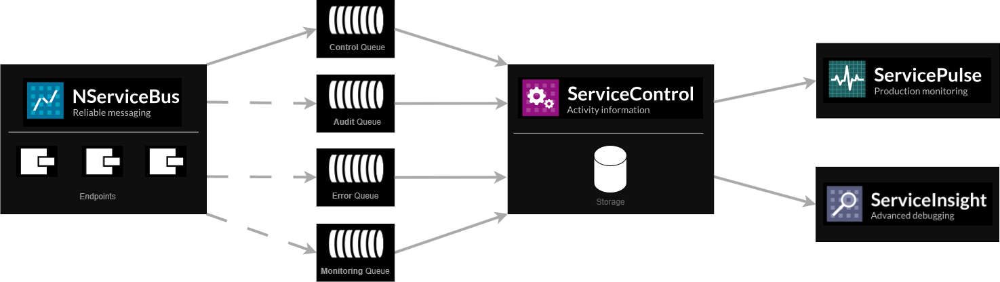

Messaging is a good way to build loosely coupled, scalable and reliable systems. However, it also has its challenges. The most common difficulty is having visibility of what's happening in the system. This is one of the problems that the Particular Service Platform was built to solve.

The goal of the Platform is to provide a set of tools that make the building and maintenance of messaging systems easier. The tools are tailored to common needs of a messaging system and 'just work' out of the box, enabling developers to focus on other important challenges such as understanding their business domain better. Currently, the Particular Service Platform consists of [NServiceBus](/nservicebus), [ServiceControl](/servicecontrol), [ServiceInsight](/serviceinsight) and [ServicePulse](/servicepulse).

## [NServiceBus](/nservicebus) - where it all begins

include: nservicebus

## [ServiceControl](/servicecontrol) - the foundation

include: servicecontrol

## [ServiceInsight](/serviceinsight) - message flow visualization

include: serviceinsight

## [ServicePulse](/servicepulse) - production monitoring

include: servicepulse

## Working with the platform

Having ServiceControl and ServiceInsight installed locally on a machine gives significant benefits during development, especially when investigating failures and defects. Additionally, if developing a [custom check](/servicecontrol/plugins/custom-checks.md) it is useful to have the full platform installed on a development machine.

After a solution is deployed, ServiceControl and ServicePulse should exist in each environment it was deployed to (e.g. one instance per integration, another one for test and one more for production). ServiceInsight is a client install, so it can be installed on a local machine only and point it to the specific environment or local instance URL.
