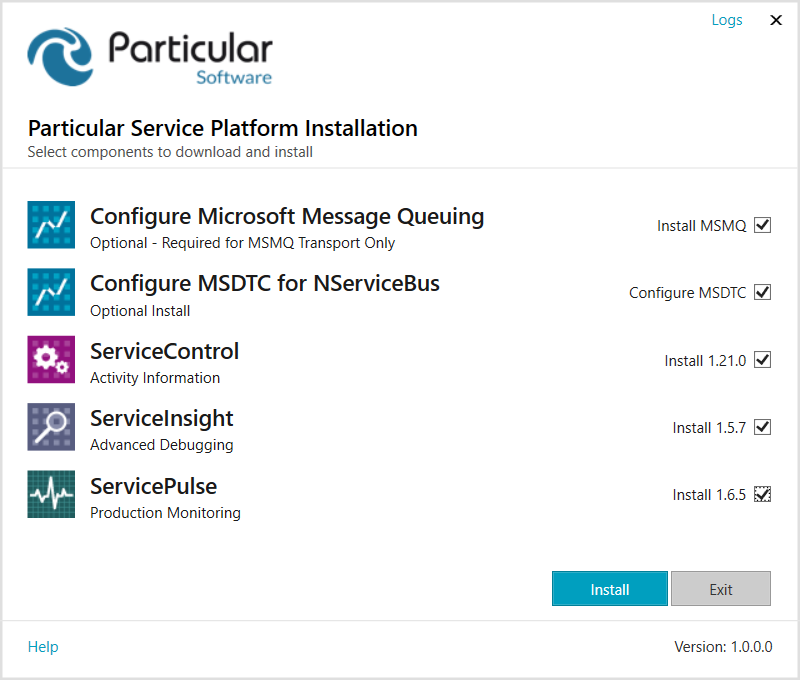

WARN: The Platform Installer is no longer maintained. [Individual product installers](https://particular.net/downloads) should be used instead.

The Platform Installer is recommended for use on development machines only. This is because:

 * The Platform Installer requires internet access which may not be available in a production environment.
 * The Platform Installer `setup.exe` will fail on Windows servers that have IE Enhanced Security Configuration enabled.

<div class="text-center inline-download hidden-xs"><a id='download-demo' href='https://particular.net/start-platform-download' class="btn btn-primary btn-lg"><span class="glyphicon glyphicon-download-alt" aria-hidden="true"></span> Download the Platform Installer</a>
</div>


For testing and production environments it is recommended to:

 * Use the [NServiceBus PowerShell Module](/nservicebus/operations/management-using-powershell.md) to install any required prerequisites.
 * Download and run the individual installers from [downloads](https://particular.net/downloads) rather than installing via the Platform Installer.


## What to expect

The Platform Installer is a [Microsoft Click-Once](https://docs.microsoft.com/en-us/visualstudio/deployment/clickonce-security-and-deployment) application, which means it has a built-in self-updating mechanism. Click-Once applications are sometimes blocked by corporate firewalls or software restriction policies. If the Platform Installer fails, review the [offline install](offline.md) page for installation instructions.


### Dependencies

The Click-Once `setup.exe` will install [.NET 4.5.2](https://www.microsoft.com/en-us/download/details.aspx?id=42643) if required and will then bootstrap the Platform Installer application.


### License acceptance

Before proceeding with product selection, the Platform Installer will prompt to accept the NServiceBus license agreement.


### Proxy credentials

The Platform Installer requires internet access to download individual packages. If non-Windows integrated proxy authentication is required, a credentials dialog will be shown.


This dialog offers to save credentials for future use. If the Save Credentials option is chosen, the credentials will be encrypted and stored in the registry at `HKEY_CURRENT_USER\Software\Particular\PlatformInstaller\Credentials` for use in subsequent launches of the Platform Installer.


## Select items to install

The Platform Installer will prompt for the items to install. Individual components can be selected for installation or upgrade. If the latest version of a product is installed, no checkbox will be displayed for that item as there is no installation or upgrade action required. Similarly if the Platform Installer cannot communicate with the version information feed, it will also disable product selection.




#### Configure Microsoft Message Queuing

This installation runs the appropriate [Deployment Image Servicing and Management (DISM.exe)](https://docs.microsoft.com/en-us/previous-versions/windows/it-pro/windows-8.1-and-8/hh825236(v=win.10)) command line to install the required Windows Features for [Message Queuing (MSMQ)](https://docs.microsoft.com/en-us/previous-versions/windows/desktop/legacy/ms711472(v=vs.85)). The installation will also check to ensure that any unsupported MSMQ Windows Features are not installed. This installation is required only if MSMQ is going to be used as the message transport. The other supported message transports are detailed in the [transports](/transports/) documentation.


#### Configure MSDTC for NServiceBus

This installation configures [Microsoft Distributed Transaction Coordinator (DTC)](https://docs.microsoft.com/en-us/previous-versions/windows/desktop/ms684146(v=vs.85)) for usage by NServiceBus. The configuration sets the following registry values in `HKEY_LOCAL_MACHINE\SOFTWARE\Microsoft\MSDTC\Security`:

 * Enable Network DTC Access. `NetworkDtcAccess` is set to `1`.
 * Allow Outbound transactions:
  * `NetworkDtcAccessOutbound` is set to `1`
  * `NetworkDtcAccessTransactions` is set to `1`
  * `XaTransactions` is set to `1`

 This install is optional.


#### ServiceInsight

Installs the ServiceInsight application. This MSI can be downloaded directly from the [ServiceInsight releases](https://github.com/Particular/ServiceInsight/releases/latest) page.


#### ServicePulse

Installs the ServicePulse application. This MSI can be downloaded directly from the [ServicePulse releases](https://github.com/Particular/ServicePulse/releases/latest) page.


#### ServiceControl

Installs the ServiceControl application. This MSI can be downloaded directly from the [ServiceControl releases](https://github.com/Particular/ServiceControl/releases/latest) page.


## Troubleshooting


### Downloads

The Platform Installer caches the downloaded MSI files in `%temp%\Particular\PlatformInstaller`. These files are downloaded directly from GitHub. Some corporate firewalls prevent the downloading of executable files via content filters or by blocking specific web sites. If the Platform Installer cannot download the individual applications, consult with the network administration staff.


### Logs

The Platform Installer logs activity in `%appdata%\PlatformInstaller`. The current log file will be named according to the current date. For example, a log created on January 25, 2018 would result in the filename `log-20180125.txt`.


### MSI logs

The command line options used for the MSI installations ensure that a detailed log file is produced for each installation. These files are located alongside the Platform Installer logs in `%appdata%\PlatformInstaller`.

An installation or upgrade of a product will overwrite any existing MSI log for that product.

MSI installers provide detailed error information via error codes. [MSI error messages](https://docs.microsoft.com/en-us/windows/win32/msi/error-codes) can assist in troubleshooting installation issues.


### Click-Once

As previously mentioned, Click-Once can be problematic in some environments or circumstances. The following links provide some tips on troubleshooting issues with Click-Once.

* [Click-Once Deployment](https://docs.microsoft.com/en-us/visualstudio/deployment/clickonce-security-and-deployment?view=vs-2019)
* [Troubleshooting Click-Once Deployments](https://docs.microsoft.com/en-us/visualstudio/deployment/troubleshooting-clickonce-deployments)


### Click-Once and Enhanced Security on Windows Server 2012 R2

Error shown:

```
An error occurred trying to download
'https://s3.amazonaws.com/particular.downloads/PlatformInstaller/PlatformInstaller.application'.

See the setup log file located at
'C:\Users\ADMINI~1\AppData\Local\Temp\VSD9C86.tmp\install.log' for more information.
```

Log file content:

```
URLDownloadToCacheFile failed with HRESULT '-2146697208'
Error: An error occurred trying to download
'https://s3.amazonaws.com/particular.downloads/PlatformInstaller/PlatformInstaller.application'.
```

Resolve this by (temporarily) disabling IE Enhanced Security.
