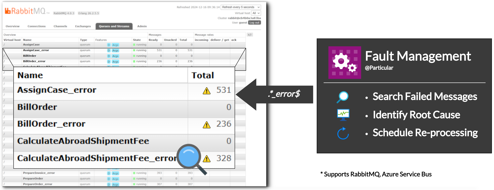
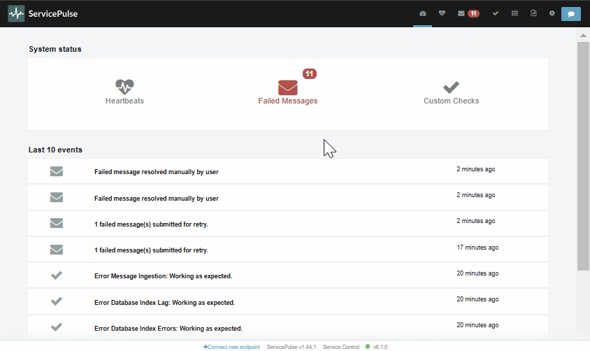

The Particular Service Platform now offers its error management capabilities for MassTransit endpoints on RabbitMQ and Azure Service Bus under the [early access license - for free](https://particular.net/eula/early_access).

This functionality ingests messages from specified [error](https://masstransit.io/documentation/concepts/exceptions#error-pipe) or [dead-letter](https://masstransit.io/documentation/concepts/exceptions#dead-letter-pipe) queues for endpoints running in a MassTransit system.
The platform provides an aggregated view of the information necessary to detect, diagnose, and fix problems causing the errors as well as the ability to send failed messages to be reprocessed.

youtube: https://www.youtube.com/watch?v=h5gcHWizS7o++

<a id='masstransit-sample' target="_blank" href='https://github.com/particular/MassTransitShowcaseDemo/' class="btn btn-primary btn-lg">Check the GitHub Showcase</a>

### Managing errors

After the ingestion, failed messages are available in the platform. It enables navigating the list of errors, displaying details of the failed message (including exception details), and sending the message to be reprocessed.

In addition, the platform offers more advanced features such as [retry redirects](/servicepulse/redirect.md) and [failed message editing](/servicepulse/intro-editing-messages.md).

This is done with a [container](/servicecontrol/masstransit/) which runs alongside the existing MassTransit system and monitors for any failed messages that occur within it.

### Pricing

During the [early access period](https://particular.net/eula/early_access), this functionality is entirely free.

### Easy to remove

As the error management capability is packaged in containers, removing it is very simple:

1. Disable the [connector container](https://hub.docker.com/r/particular/servicecontrol-masstransit-connector)
1. [Retry all the failed messages](/servicepulse/intro-failed-message-retries.md#servicepulse-interface-retrying-failed-messages)
1. [Validate that all pending retries have completed](/servicepulse/intro-pending-retries.md)
1. [Remove all 4 containers from your system](/servicecontrol/masstransit/docker-deployment.md)
1. (Optional) Remove the [platform queues](/servicecontrol/masstransit/#what-queues-are-created)
1. Done!

### Questions? Concerns?

[Talk to us!](https://discuss.particular.net/tag/masstransit)
