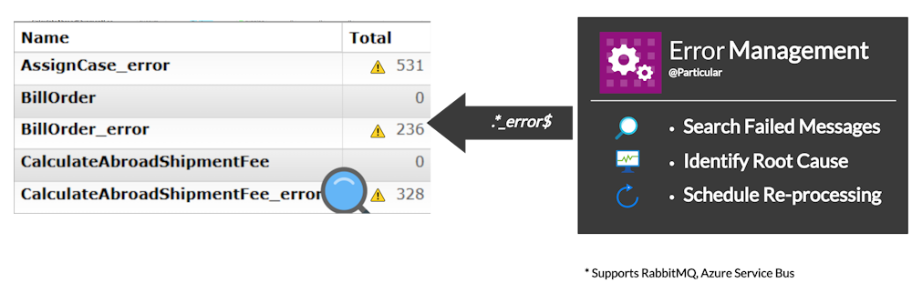

The Particular Service Platform provides recoverability features for MassTransit endpoints on RabbitMQ and Azure Service Bus

It auto-detects and ingests messages from the [error](https://masstransit.io/documentation/concepts/exceptions#error-pipe) and [dead-letter](https://masstransit.io/documentation/concepts/exceptions#dead-letter-pipe) queues for all endpoints running in your system. The platform provides an aggregated view of the information necessary to detect, diagnose, and fix problems causing the failures as well as the ability to schedule failed messages for re-processing.

The [MassTransit Connector for ServiceControl](/servicecontrol/masstransit/) is part of the Particular Service Platform, which adds error queue and dead letter queue monitoring to MassTransit systems. This container runs alongside the existing MassTransit system and monitors for any faulted messages that occur within the system.

### Managing failures

After the ingestion, failing messages are available via ServicePulse which is the UI for the platform. It enables navigating the list of failures, displaying details of the failed messsage (including exception details), as well as scheduling message for reprocessing.

In addition, ServicePulse offers more advanced features such as [retry redirects](/servicepulse/redirect.md) and [failure message editting](/servicepulse/intro-editing-messages.md).

<a id='masstransit-sample' target="_blank" href='https://github.com/particular/MassTransitShowcaseDemo/' class="btn btn-primary btn-lg"> See it in action</a>

