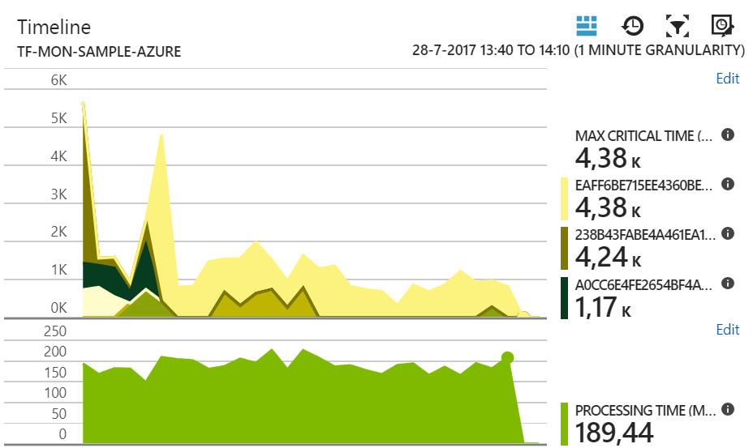
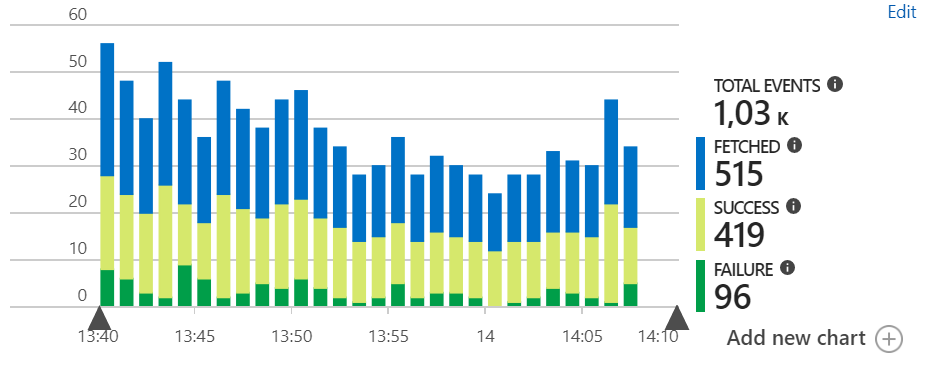

[Azure Application Insights](https://azure.microsoft.com/en-us/services/application-insights/) provides monitoring and alerting capabilities that can be leveraged to monitor the health of NServiceBus endpoints. This sample demonstrates the ability to report metric data to Azure Application Insights.

This sample reports the following metrics to Application Insights:

 * Fetched messages per second 
 * Failed messages per second
 * Successful messages per second
 * Average message processing time in milliseconds
 * Maximum critical time in milliseconds
 * Minimum hours before Service Level Agreement (SLA) violation countdown

For a detailed explanation of these metrics refer to the [metrics captured section in the metrics documentation](/nservicebus/operations/metrics.md#metrics-captured).

## Prerequisites

An Application Insights account and instrumentation key. The instrumentation key can be obtained under the Application Insights instance properties pane in the Azure portal.

## Code overview

The sample simulates messages load with a random 10% failure rate using the `LoadSimulator` class:

snippet: load-simulator

## Connect to Azure Application Insights

To connect the sample code to Application Insights, the instrumentation key needs to be provided.

By default the sample code loads this key from an environment variable called `ApplicationInsightKey`. Either set this environment variable or paste the instrumentation key in the following section.

snippet: configure-ai-instrumentation-key

## Use NServiceBus.Metrics to capture metric values

To capture the metric values generated by NServiceBus, a class called `ApplicationInsightsFeature` is added to the sample. It is responsible for enabling the NServiceBus metrics feature.

snippet: enable-nsb-metrics

It ensures that the telemetry probe is subscribed to the event stream. During this stage the `ApplicationInsightsProbeCollector` is configured and wired. Information such as *endpoint name* and *input queue* are passed to allow advanced data analysis in Application Insights.  

snippet: register-probe

Events and metrics are buffered and the Application Insights telemetry client does this every minute. If the process would gracefully stop we need to ensure that any pending events are flushed to Application Insights when the endpoint is stopped.

snippet: flush-probe

## Send captured metric data to Application Insights

The `ApplicationInsightsProbeCollector` is used to pass NServiceBus captured metric data to the Application Insights instance configured earlier. Information passed is added as telemetry context properties, which will be attached to every metric (NServiceBus signal probe) and event (NServiceBus duration probe) captured via the telemetry client. The telemetry client is used to communicate with Application Insights.

snippet: telemetry-client

When the `ApplicationInsightsProbeCollector` is registered with the NServiceBus metrics API, it registers observer callbacks to receive probe names, signals and durations. Signals are converted into Application Insights custom events. Durations are converted into Application Insights metrics.

snippet: observers-registration

## Setting up charts for metrics and events (signals and durations)

The easiest way to setup graphs for metrics in Application Insights is to go to the `Metrics Explorer`, add a new graph selecting the custom metric of choice and then use the push pin symbol to add it to a dashboard.

The following graphs show the following metrics:

 * Maximum critical time & critical time grouped by instance id.
 * Average processing time, not grouped.
 * Minimum hours countdown until Service Level Agreement violation.

Similar for events, the following graphs shows all events grouped by event name. This graph can be furthered filtered down to e.g. show failures only.

Service Level Agreement countdown represents an estimation of the amount or hours remaining until the configured Service Level Agreement (max critical time) will not be met. A graph that is gradually sliding down is indicating that a breach is about to happen. When grouping this metric the MIN value should be reported.

Refer to the Microsoft documentation for more information on [creating dashboards from the metrics explorer](https://docs.microsoft.com/en-us/azure/application-insights/app-insights-dashboards)

Using the metrics explorer is an easy way to get started, but to create truly advanced graphs Application Insights offers an [advanced analytics environment](https://docs.microsoft.com/en-us/azure/application-insights/app-insights-analytics). 
