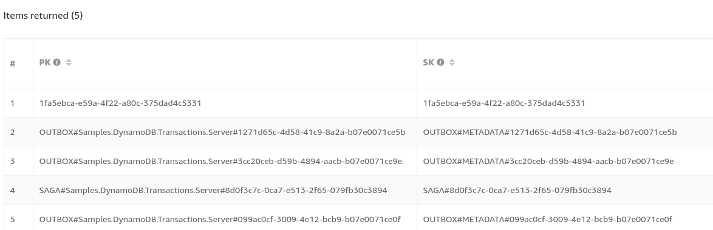

This sample shows a client/server scenario using saga and outbox persistence to store records atomically by leveraging transactions.

## Prerequisites

The sample uses a [DynamoDB local instance](https://docs.aws.amazon.com/amazondynamodb/latest/developerguide/DynamoDBLocal.html) by default. See the [AWS guidance on deploying DynamoDB local](https://docs.aws.amazon.com/amazondynamodb/latest/developerguide/DynamoDBLocal.DownloadingAndRunning.html#docker).

Alternatively with Docker installed locally, execute the following command in the solution directory:

```bash
docker-compose up -d
```

the data is only kept in memory and will be gone when the container is removed. It is possible to inspect the data written to DynamoDB by using the [NoSQL Workbench for DynamoDB](https://docs.aws.amazon.com/amazondynamodb/latest/developerguide/workbench.html). The below screenshot shows the PK and SK created for the not yet completed Saga, the outbox entries and the transactionally inserted `OrderShippingInformation`.



## Projects

### Client

* Sends the `StartOrder` message to `Server`.
* Receives and handles the `OrderCompleted` event.

### Server projects

* Receive the `StartOrder` message and initiate an `OrderSaga`.
* `OrderSaga` requests a timeout with an instance of `CompleteOrder` with the saga data.
* Receive the `OrderShipped` message with a custom header.
* `OrderSaga` publishes an `OrderCompleted` event when the `CompleteOrder` timeout fires.

### SharedMessages

Contains the shared message contracts used by all endpoints.

## Persistence config

Configure the endpoint to use DynamoDB Persistence.

snippet: DynamoDBConfig

The handler also creates `OrderShippingInformation` by participating in the transactional batch provided by NServiceBus.

snippet: DynamoDBStorageSession

## Order saga data

snippet: sagadata

## Order saga

snippet: thesaga
