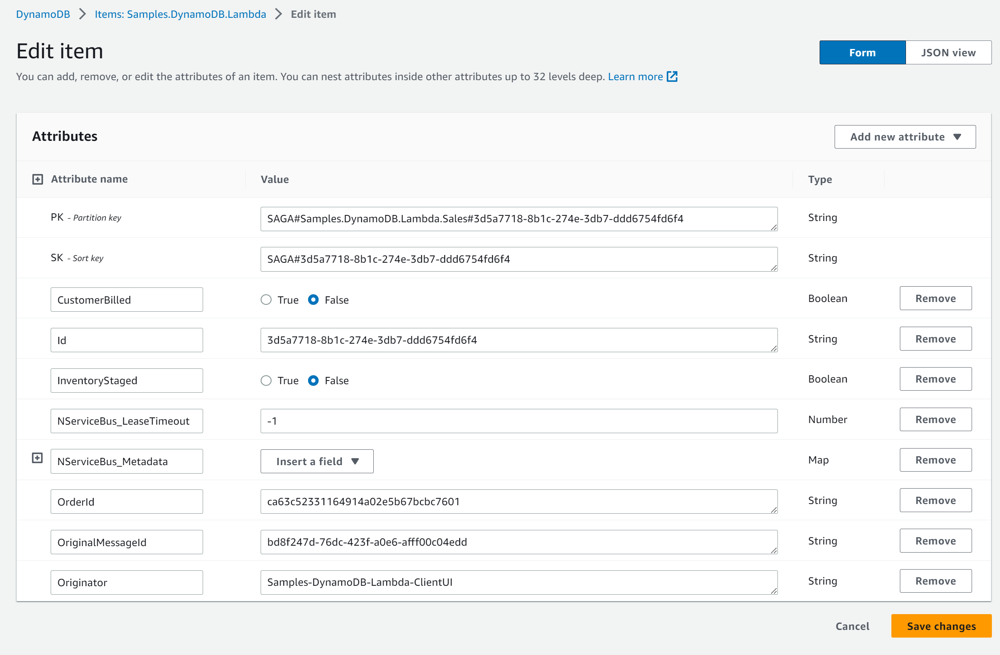

This sample shows a basic saga using AWS Lambda, SQS, and DynamoDB.

downloadbutton

## Prerequisites

The sample includes a [`CloudFormation`](https://aws.amazon.com/cloudformation/aws-cloudformation-templates/) template that deploys the Lambda function and creates the necessary queues to run the code.

The [`Amazon.Lambda.Tools` CLI](https://github.com/aws/aws-lambda-dotnet) can be used to deploy the template to an AWS account.

1. Install the [`Amazon.Lambda.Tools CLI`](https://github.com/aws/aws-lambda-dotnet#amazonlambdatools) using `dotnet tool install -g Amazon.Lambda.Tools`
1. Make sure an [S3 bucket](https://aws.amazon.com/s3/) is available in the [AWS region](https://docs.aws.amazon.com/AmazonS3/latest/userguide/Welcome.html#Regions) of choice

## Running the sample

> [!NOTE]
> It is not possible at this stage to use the AWS .NET Mock Lambda Test Tool to run the sample locally.

Run the following command from the `Sales` directory to deploy the Lambda project:

`dotnet lambda deploy-serverless`

The deployment will ask for a stack name and an S3 bucket name to deploy the serverless stack. After that, running the sample will launch a single console window:

* **ClientUI** is a console application that will send a `PlaceOrder` command to the `Samples.DynamoDB.Lambda.Sales` endpoint, which is monitored by the AWS Lambda.
* The deployed **Sales** project will receive messages from the `Samples.DynamoDB.Lambda.Sales` queue and process them using the AWS Lambda runtime.

To try the AWS Lambda:

1. From the **ClientUI** window, press <kbd>Enter</kbd> to send a `PlaceOrder` message to the trigger queue.
2. The AWS Lambda will receive the `PlaceOrder` message and will start the `OrderSaga`.
3. The `OrderSaga` will publish an `OrderReceived` event and a business SLA message `OrderDelayed`.
4. The AWS Lambda receives the `OrderReceived` event, which is handled by the `BillCustomerHandler` and the `StageInventoryHandler`. After a delay, each handler publishes an event, `CustomerBilled` and `InventoryStaged`, respectively.
5. The AWS Lambda will receive the events. Once both events are received, the `OrderSaga` publishes an `OrderShipped` event. If it takes longer than the defined business SLA to bill and stage the order, the client is notified that the order is delayed by publishing `OrderDelayed`.
6. The **ClientUI** will handle the `OrderShipped` event and log a message to the console. It might also occasionally handle the `OrderDelayed` event and hand out 10% coupon codes.

## Code walk-through

The **ClientUI** console application is an Amazon SQS endpoint that sends `PlaceOrder` commands and handles the `OrderShipped` event.

The **Sales** project is hosted using AWS Lambda. The static NServiceBus endpoint must be configured with details from the AWS Lambda `ILambdaContext`. Since that is not available until a message is handled by the function, the NServiceBus endpoint instance is deferred until the first message is processed, using a lambda expression such as:

snippet: EndpointSetup

The same class defines the AWS Lambda function that hosts the NServiceBus endpoint. The `ProcessOrder` method hands off processing of the message to NServiceBus:

snippet: FunctionHandler

Meanwhile, the `OrderSaga` hosted within the AWS Lambda project is a standard NServiceBus saga that can also send and receive messages.

snippet: OrderSaga

The saga data is stored in the `Samples.DynamoDB.Lambda` table and can be viewed in the AWS web portal:

## Removing the sample stack

Remove the deployed stack with the following command:

`dotnet lambda delete-serverless`

and provide the previously chosen stack name.
