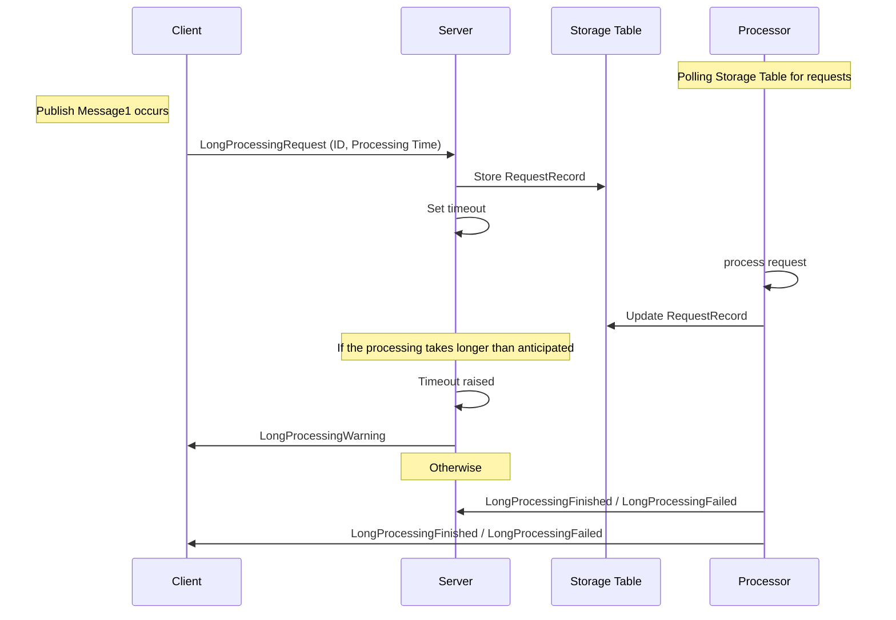

include: legacy-asb-warning

## Prerequisites

include: asb-connectionstring-xplat

include: asp-connectionstring

include: asb-transport

## Code walk-through

This sample shows a simplified long-running process

 * `Client` makes a request for processing with a unique ID.
 * `Server` enqueues requests from `Client` to be processed by `Processor`.
 * `Processor` raises events about successful or failed results.
 * `Server` issues warnings for `Client` if the estimated processing time is going to be violated. 

## Performing processing outside a message handler

When processing takes a long time, [message lock renewal](/transports/azure-service-bus/legacy/message-lock-renewal.md) is possible, but should be avoided to keep message locking to a minimum. 

include: autorenewtimeout-warning

An alternative approach is to perform a long-running operation in an external service, outside of a message handler context and notify the interested parts of the results. 

This sample is using a standalone process `Processor` to run an emulated long running work and raises events for successful or failed outcomes. `Server` and `Processor` use Azure Storage table to communicate `RequestRecord`s in the `Requests` table.

For simplicity, `Processor` is not scaled out. If scaling out is required, work on an individual request must be locked to a single instance of a processor. A common way to achieve this is to create a blob with a request ID as a name on the storage account and get a lease to that file.

Also, note that the sample processes files in a serial manner, one at a time. For concurrent processing, `Processor` could spin a task per request. That would require an additional throttling mechanism to be implemented to ensure `Processor` is not overwhelmed.

## Making a request from the client

snippet: request-message

## Business logic with saga and timeout

Setting a timeout:

snippet: setting-timeout

On timeout:

snippet: on-timeout

## Server communication

`Server` enqueues requests for the processor using an Azure Storage table and replying back to the `Client` to indicate that processing is pending. 

snippet: enqueue-request-for-processor

NOTE: Normally, work would not be done by a saga, but would be delegated to a dedicated handler. For simplicity, a handler was omitted in this sample.

## Processor logic

`Processor` performs two never-ending tasks - polling every 5 seconds for pending requests, and processing those requests.

snippet: tasks

During processing, an exception is emulated randomly to demonstrate a failing scenario.

snippet: failed-scenario
