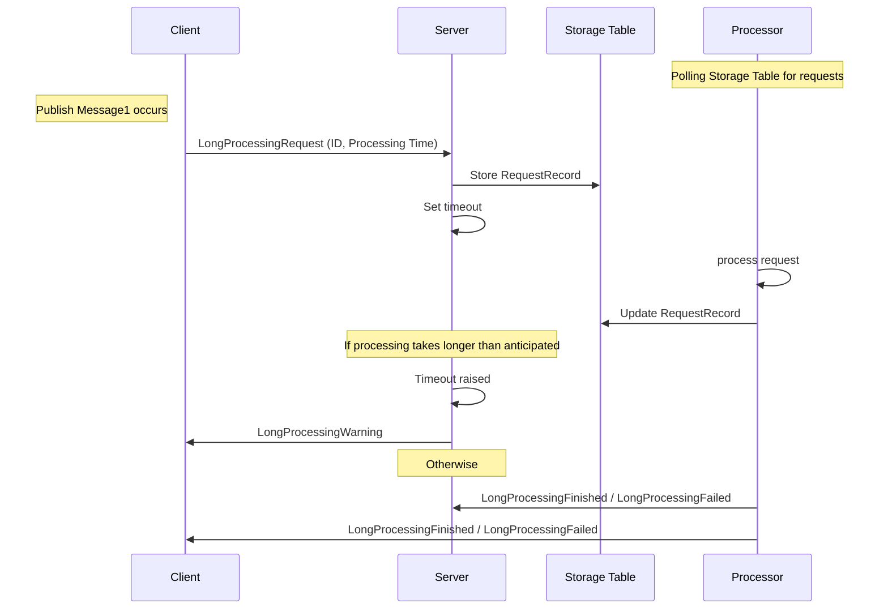

## Prerequisites

include: asb-connectionstring

include: asp-connectionstring

include: asb-transport

## Code walk-through

This sample shows a simplified long running process

 * `Client` makes a request for processing with a unique ID.
 * `Server` enqueues requests from `Client` to be processed by `Processor`.
 * `Processor` raises events about successful or failed results.
 * `Server` issues warnings for `Client` if estimated processing time is going to be violated. 

## Performing processing outside of a message handler

When processing is taking a long time, [message lock renewal](/transports/azure-service-bus/message-lock-renewal.md) can be used, but should be avoided to keep message locking to the minimum. 

include: autorenewtimeout-warning

The alternative approach is to perform a long running operation in an external service, outside of a message handler context and notify the interested parts of the results. 

This sample is using a standalone process `Processor` to run an emulated long running work and raises events for successful or failed outcomes. `Server` and `Processor` use Azure Storage table to communicate `RequestRecord`s in the `Requests` table.

For simplicity of this sample, `Processor` is not scaled out. In case scale out is required, work on an individual request has to be locked to a single instance of a processor. A common way to achieve that would be creating a blob with request ID as a name on storage account and get a lease to that file. Also, the sample processes files in a serial manner, one at a time. For concurrent processing, `Processor` could spin a task per request. That would require an additional throttling mechanism to be implemented to ensure `Processor` is not overwhelmed.

## Making a request from the client

snippet: request-message

## Business logic with saga and timeout

Setting a timeout:

snippet: setting-timeout

On timeout:

snippet: on-timeout

## Server communication

`Server` enqueues request for the processor using Azure Storage table and replying back to the `Client` to indicate that processing is pending. 

snippet: enqueue-request-for-processor

NOTE: Normally, work would not be done by the Sagas, and would be delegated to a dedicated handler. For simplicity of this sample, a handler was omitted.

## Processor logic

`Processor` performs to never ending tasks - polling every 5 seconds for pending requests and processing those 

snippet: tasks

During processing, a processing exception is emulated randomly to demonstrate a failing scenario.

snippet: failed-scenario