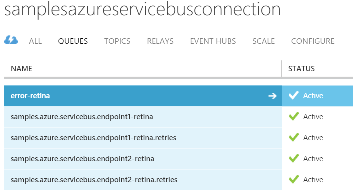

## Prerequisites

include: asb-connectionstring

include: asb-transport

## Code walk-through

This sample shows a simple two endpoint scenario.

 * `Endpoint1` sends a `Message1` message to `Endpoint1`.
 * `Endpoint2` replies to `Endpoint1` with a `Message2`.

### Azure Service Bus configuration

The `Server` endpoint is configured to use the Azure Storage persistence in two locations.

snippet: Config

Some things to note:

 * The use of the `SamplesAzureServiceBusConnection` environment variable mentioned above.
 * The use of `UseSingleBrokerQueue` prevents the Azure transport individualizing queue names by appending the machine name.

## The Data in Azure Storage

The queues for the two endpoints can be seen in the Azure Portal.

