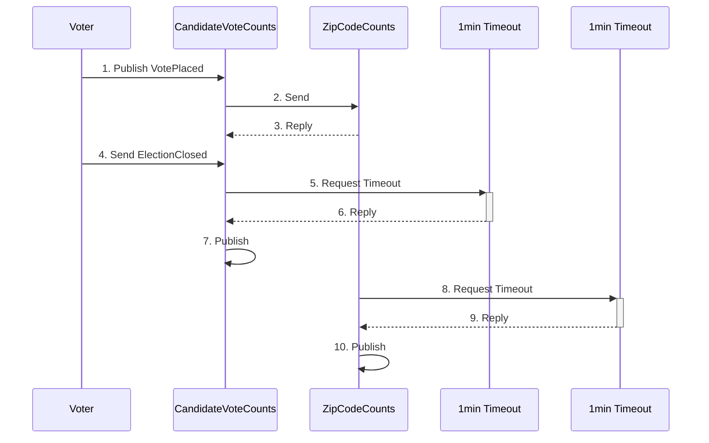

## Prerequisites

1. Strong understanding of Service Fabric [Reliable Services](https://docs.microsoft.com/en-us/azure/service-fabric/service-fabric-reliable-services-quick-start). 
1. Service Fabric [development environment setup](https://docs.microsoft.com/en-us/azure/service-fabric/service-fabric-get-started) with dev cluster configured to run on 5 nodes.
1. An Azure Service Bus namespace that can be used for communication between the instances.
1. A system environment variable named "AzureServiceBus.ConnectionString" set to the connection string of the Azure Service Bus namespace. The connection string must provide Manage rights.

Note: A Service Fabric cluster runs under the Network Service account and only reads system environment variables. Make sure the environment variable "AzureServiceBus.ConnectionString" is defined as a system environment variable and not user-scoped.

## Scenario

The scenario used in this sample covers a voting system. In this voting system the cast votes are counted by candidate. The cast votes are `published` from the voter client to the endpoint responsible for counting candidate votes.

Next to this the system also counts the total number of votes cast in each zip code. In order to achieve this the candidate voting endpoint issues a `request` to the zip code counting endpoint to track the zip code. The zip code counting endpoint will `reply` back with the intermediary results.

When the election is closed, the candidate vote counting endpoint will `publish` the results per candidate and report them using Service Fabric diagnostics infrastructure ([ETW Event Viewer windows](https://docs.microsoft.com/en-us/azure/service-fabric/service-fabric-diagnostics-how-to-monitor-and-diagnose-services-locally#view-service-fabric-system-events-in-visual-studio)).

After the counting time expires, using a `timeout`, the zip code counting endpoint `sends a local command` to report the statistics per zip code.

The sample assumes that:
    * There are only 2 candidates in the election, called "John" and "Abby",
    * Zip codes are integers in the range of 0 to 99000. 
    
This simplifies partition id value calculation, in real world scenario a hash function could be used to perform mapping from arbitrary input types.

### Trade offs and known limitations

The scenario has been set up to show the different kinds of communication patterns that can occur in a partitioned solution: `send`, `send local`, `publish/subscribe`, `request/reply`, `timeout`.

The downside of the focus on the communication patterns is that the saga design is less than ideal for a real voting system. There will be quite some contention on the saga data, which may result in concurrency exceptions and a few retries impacting performance of the system.

For logging purposes a simple static logger was used to expose specific log statements for the routing part. It is recommended to use a dedicated package to emit ETW logging information.

## Solution structure

The solution contains the following projects:

 * **Contracts**: Contains message definitions that are shared among projects.
 * **Shared**: Contains the receiver side distribution and the sender side distribution code.
 * **Voter**: This is a console application that simulates casting of votes. It is hosted outside of the Service Fabric cluster. 
 * **CandidateVoteCount**: Service Fabric service with the logic to count votes by candidate while the votes come in. It also instructs the `ZipCodeVoteCount` endpoint to track votes by zip code. It will report the intermediate results as well as the final results when the election is closed.
 * **ZipCodeVoteCount**: Service Fabric service with the logic to count the votes by zip code in the background. It will report the results when the allowed counting period is over.
 * **ServiceFabricRouting**: [Service Fabric application](https://docs.microsoft.com/en-us/azure/service-fabric/service-fabric-application-model) containing description of services it will run when deployed into Service Fabric cluster.

## Cluster partitioning

The `CandidateVoteCount` is a [stateful service](https://docs.microsoft.com/en-us/azure/service-fabric/service-fabric-reliable-services-introduction) that uses a `NamedPartition` [partitioning scheme](https://docs.microsoft.com/en-us/azure/service-fabric/service-fabric-concepts-partitioning). Each candidate has its own partition, so there is one called "John" and another called "Abby". 

The `ZipCodeVoteCount` is a stateful service that uses a `UniformInt64Partition` partitioning scheme with the `PartitionCount` set to 3, the `LowKey` set to 0 and the `HighKey` set to 99000. This configuration ensure that the partition is split into 3 well-known ranges (0 -> 32999), (33000 -> 65999) , (66000 -> 98999).

## Routing

The default NServiceBus routing approach cannot be used as-is with Service Fabric stateful services. Stateful services assume business data partitioning. A message must be routed to a specific replica (instance) of a stateful service that can handle the message data. E.g. for each `PlaceVote` message associated with a cast vote, the message should be routed to the partition associated with the preferred candidate, "John" or "Abby". Similar to that, to count the votes per zip code the `TrackZipCode` message needs to be routed to the partition that is responsible for the range to which the zip code belongs.

Example:

- Vote for John; cast in 88701; should result in a `PlaceVote` message routed to named partition "John", followed by a `TrackZipCode` message routed to range partition (66000 -> 98999).
- Vote for Abby; cast in 36458; should result in a `PlaceVote` message routed to named partition "Abby", followed by a `TrackZipCode` message routed to range partition (33000 -> 65999).
- Vote for John; cast in 12789; should result in a `PlaceVote` message routed to named partition "John", followed by a `TrackZipCode` message routed to range partition (0 -> 32999).

Partition-aware behavior is achieved by combining sender-side distribution (a built-in NServiceBus feature) with a few modifications to the message processing pipeline.

The remainder of this document will focus on the different techniques that can be used to configure these distribution strategies, either manually or automatically, to achieve full partition aware routing. 

## Partitioned Endpoint Configuration

Endpoint instances hosted with stateful service replicas need to be uniquely addressable by the partition key associated with each replica. Possible keys are defined by the `NamedPartition` and `Int64RangePartition` info obtained from Service Fabric. The unique partition keys are used for `SendLocal` and `ReplyTo` operations to route messages to the correct partitions.

Partitioned endpoints require specifying partitioning configuration by calling an extension method on `EndpointConfiguration`:

snippet: ApplyPartitionConfigurationToEndpoint-ZipCodeVoteCount

### Local sends

All local sends are handled by the `PartitionAwareDistributionStrategy`. For each locally sent message it sets the `partition-key` header value to the local partition key and routes the message to the queue associated with the local partition.

### Replies

When replying, an endpoint routes the reply message to the endpoint that initiated the conversation. It's the responsibility of the requestor to properly set the reply-to header before sending out the request. For a partitioned endpoint this implies that it sets the reply-to header to its instance specific queue instead of the shared queue. This functionality is covered by the `HardcodeReplyToAddressToLogicalAddress` behavior.

## Receiver Side Distribution

Receiver Side Distribution validates if a replica of a partitioned endpoint can process an incoming message or should forward it to the appropriate replica instead. Partition validation is performed by inspecting message headers and the message body.

A partitioned endpoint can be configured to check that an incoming message should be processed locally. If it is not the case, the message is forwarded to the correct partition.

### Message headers inspection

Every incoming message has its `partition-key` header value inspected by the `DistributeMessagesBasedOnHeader` behavior. If the value specified in the header is matching the receiver's partition key, then the message is processed. Otherwise, the message is forwarded to the appropriate partition specified by the header value. If the partition key value indicates non-existent partition, the message is moved to the error queue.

If the `partition-key` header does not exist, the pipeline execution continues to the *Message body inspection* step.

### Message body inspection

If message headers inspection is unsuccessful with value extraction of `partition-key` header, then the message body is used to determine the partition key value. The `DistributeMessagesBasedOnPayload` behavior determines the partition value using the mapping function provided via the configuration API. The result of the mapping function is stored as the `partition-key` header value. The inspection logic can raise a `PartitionMappingFailedException` exception if the partition key is not a valid partition key for a given endpoint. For a partition key that is not local, the message is forwarded to the appropriate partition. 

The forwarding/processing decision is made in the same way as in the *Header inspection* step.

NOTE: `PartitionMappingFailedException` is considered an [unrecoverable exception](/nservicebus/recoverability/custom-recoverability-policy.md). Whenever such an exception is raised the message that triggered the exception will be moved immediately to the configured error queue.

### Control message forwarding

When an endpoint instance receives a control message representing either the [Subscribe or Unsubscribe intent](/nservicebus/messaging/headers.md#messaging-interaction-headers-nservicebus-messageintent), the message is forwarded to all other partitions.

### Configuration

To enable Receiver Side Distribution for a specific endpoint, two arguments need to be provided:
- Endpoint discriminators that are based on Service Fabric partition keys 
- Mapping function per incoming message type that maps incoming messages to a partition key

Use this code to enable Receiver-Side distribution:

snippet: ConfigureReceiverSideDistribution-CandidateVoteCount

## Sender Side Distribution

Receiver Side Distribution addresses forwarding messages that arrive to the incorrect partition. Forwarding received messages introduces some overhead though. To remove the overhead on the receiver side the Sender Side Distribution approach can be used to distribute messages to the correct endpoint instances based on Service Fabric partitioning information.

Sender Side Distribution can be applied to endpoints hosted inside Service Fabric by using the partition information of the stateful services. This is suitable for endpoints hosted inside the cluster that need to send messages to other endpoints hosted in the cluster. For the endpoints hosted outside of the cluster access to Service Fabric APIs is not possible. Instead, partitioning information has to be provided separately.

The Sender Side Distribution works in the following way:

1. A mapping function is applied when dispatching messages. This mapping function is intended to select a partition key based on business criteria. In this example it's either the candidate name or the zip code of the voter, depending on the message type and destination endpoint.
1. The result of this mapping, a partition key, is then added as a `partition-key` header to the outgoing message. This ensures that its value doesn't have to be calculated on the receiver side again and no receiver side distribution will occur. 
1. With determined destination, the message is sent to the instance specific queue directly.

### Partition aware distribution strategy

The Sender Side Distribution feature adds a [custom distribution strategy](/nservicebus/messaging/routing-extensibility.md#routing-apis-message-distribution) `PartitionAwareDistributionStrategy` into the outgoing pipeline, which is responsible for selecting a destination queue for each message sent to a specific endpoint. When a destination is to be selected for a given outgoing message, the mapping function is applied to obtain the partition key value. The message has its `partition-key` header value set and the instance specific queue is selected as a destination address.

### Configuration

Sender Side Distribution is configured by providing partition information for a given endpoint and ensuring each of these partitions is uniquely addressable on the receiver side.

snippet: ConfigureLocalPartitions-CandidateVoteCount

In order to send to specific destination partitions, it is required to provide a mapping function that connects a business property on the message to a partition key for each outgoing message type. 

Example of mapping a property value directly to the partition key:

snippet: configuresendersiderouting-voter

Example of mapping a property to a ranged partition key using custom logic:

snippet: ConfigureSenderSideRouting-CandidateVoteCount

### Message Driven Pub/Sub

The sample can be used with Message Driven Pub/Sub transports such as Azure Storage Queue Transport as well. The sample works out of the box but will heavily rely on Receiver Side Distribution to add the required partition keys to the header.

## Optimization strategies

| **Scenario**                                                   | **Strategy**                            |  
|----------------------------------------------------------------|-----------------------------------------|  
|Send to a Partitioned Endpoint                                  | Partition Aware Sender Side Distribution|  
|Send Local in a Partitioned Endpoint                            | Partition Aware Sender Side Distribution for Local Endpoint|  
|Directing the reply to myself, a Partitioned Endpoint           | Reply override behavior, header copying behavior on the replier|  
|Directing the reply to a different Partitioned Endpoint         | Extension method on SendOptions|  
|Publish a message to a Partitioned Endpoint using Native Pub/Sub| Broker forwards to the correct key partition based on the header key value1 |  
|Publish a message to a Partitioned Endpoint using Non Native Pub/Sub| Receiver forwards to the correct key partition based on the header key value2|  
|Request a Timeout in a Saga                                     | Parition Aware Sender Side Distribution for Local Endpoint|  

1 native distribution is not supported at this point

2 message driven pub/sub distribution on the publisher side is not supported at this point