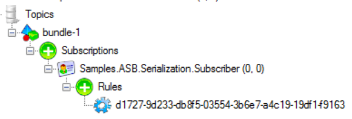

include: asb-connectionstring

include: asb-transport

## Code walk-through

This sample has two endpoints

* `Publisher`
* `Subscriber`

snippet: SomeEvent

## Publisher

`Publisher` publishes `SomeEvent`.

## Subscriber

`Subscriber` subscribes to and handles `SomeEvent`. The topology used by the endpoints is `ForwardingTopology`, which creates a subscription named `Subscriber` and creates a rule for each event the endpoint subscribes to.

`SomeEvent` full name is `Shared.Messages.In.A.Deep.Nested.Namespace.Nested.Events.SomeEvent`. That is 72 characters which exceed the maximum 50 characters limit for a rule name. An attempt to use such a long rule name will result in the following exception:

>Invalid Rule name 'Shared.Messages.In.A.Deep.Nested.Namespace.Nested.Events.SomeEvent' that cannot be used with Azure Service Bus. Rule name exceeds maximum allowed length or contains invalid characters. Check for invalid characters, shorten the name, or use 'Sanitization().UseStrategy<ISanitizationStrategy>()' configuration extension.`

### Creating custom sanitization

#### Registering custom sanitization

For the purpose of this sample, custom sanitization base on a SHA1 hashing algorithm will be used:

snippet: Sha1SanitiazationStrategy

Generated hash (20 bytes) will be formatted into eight groups of 8 characters each for readability:

snippet: SHA1DeterministicNameBuilder

Custom strategy registration:

snippet: CustomSanitization

Generated rule name:

