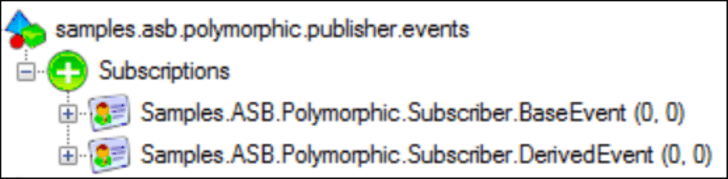
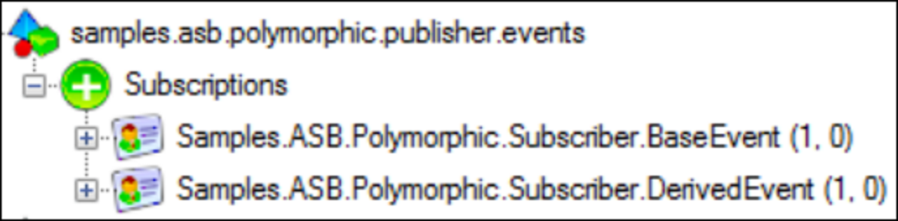

Note: For proper polymorphic events support, use `ForwardingTopology`. This sample should only be used in case `EndpointOrientedTopology` is required.


## Prerequisites

include: asb-connectionstring


include: asb-transport


## Code walk-through

This sample has two endpoints.

 * `Publisher` publishes `BaseEvent` and `DerivedEvent` events.
 * `Subscriber` subscribes and handles `BaseEvent` and `DerivedEvent` events.

`DerivedEvent` event is derived from `BaseEvent` event. The difference between the two events is an additional piece of information provided with the `DerivedEvent` in form of the `Data` property.

snippet: BaseEvent

snippet: DerivedEvent


## Publisher

The `Publisher` will publish an event of `BaseEvent` or `DerivedEvent` type based on the input it receives from the console.


## Subscriber

By default, all events handled in `Subscriber` will be auto subscribed. Default topology subscription behavior will create 2 subscriptions, one for each event.




### Auto subscription behavior

Normally, this would be fine. Though not with ASB transport and polymorphic events. Each subscription is filtering messages based on `NServiceBus.EnclosedMessageTypes` header. When an event of `BaseType` is published, it's going only into `Samples.ASB.Polymorphic.Subscriber.BaseEvent` subscription as per image below.

NOTE: In Versions 7 and above polymorphic events are supported with auto-subscription turned on when `ForwardingTopology` is used.


But whenever `DerivedEvent` event is published, both `Samples.ASB.Polymorphic.Subscriber.BaseEvent` and `Samples.ASB.Polymorphic.Subscriber.DerivedEvent` subscriptions get a copy of that message.



Since `DerivedEvent` implements `BaseEvent`, it's `NServiceBus.EnclosedMessageTypes` header will contain both types:

```
Events.DerivedEvent, Shared, Version=0.0.0.0, Culture=neutral, PublicKeyToken=null;
Events.BaseEvent, Shared, Version=0.0.0.0, Culture=neutral, PublicKeyToken=null
```

Both filters will pick the `DerivedEvent` message, causing duplicate delivery to the `Subscriber`. NServiceBus `Subscriber` endpoint will invoke handlers for each type that message implements. End result will be multiple invocations for the same message.

snippet: PublisherOutput

snippet: SubscriberOutput


### How to address

To address this in general and allow proper handling of polymorphic events, `Subscriber` has do the following:

 1. Disable automatic subscription.
 1. Subscribe explicitly to the base events only of polymorphic events.
 1. Subscribe explicitly to the non-polymorphic events it's interested in.

snippet: DisableAutoSubscripton

When an event is a polymorphic event, such as `DerivedEvent`, endpoint will subscribe to the **base event** only.

snippet: ControledSubscriptions

For this sample, configuring `Subscriber` as described above, will create the topology that only has `BaseEvent` subscription serving as "catch-all".


Results of the sample now adhere to the expected polymorphic message handling

snippet: PublisherOutput-from-sample

snippet: SubscriberOutput-from-sample

partial: RegisterPublisherNames
