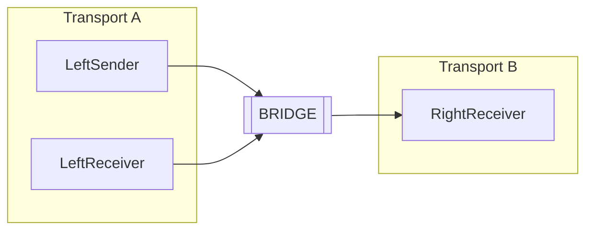
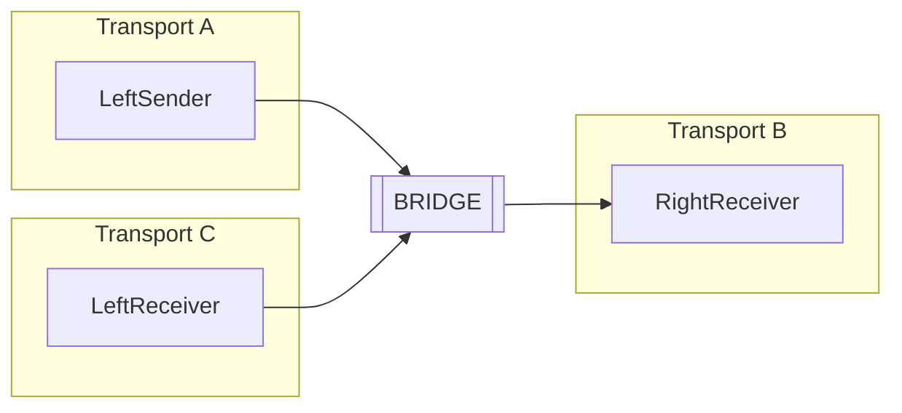

This sample shows how to bridge two different transports.

For this sample to work without installing any prerequisites, all endpoints use the [LearningTransport](/transports/learning/). To demonstrate that it can still bridge different transports, the LearningTransport on one side of the bridge is configured to store messages in a different location on disk.

## Projects

There are two projects on the left side, using LearningTransport. With one project on the right side, also using LearningTransport but stored in a different location. The transport on any side can be replaced by any other supported transport, without any configuration changes on the other side, except for in the Bridge.

### Bridge

The project that references `NServiceBus.Transport.Bridge` and contains configuration to bridge the two transports.

### SharedMessages

The shared message contracts used by all endpoints. It also includes a helper class to find the storage location for the LearningTransport.

### LeftSender

* Allows a user to
  * Sends the `PlaceOrder` command message to `RightReceiver`.
  * Publish a `OrderReceived`  message.

* Receives and handles the `OrderResponse` message.

### LeftReceiver

- Receives and handles the `OrderReceived` event.

### RightReceiver

* Receives and handles the `PlaceOrder` command and replies with a `OrderResponse` message.
* Receives and handles the `OrderRecevied` event.

## Code walk-through

Any project in the solution contains regular NServiceBus code that will not be discussed.

### LearningTransport as alternative transport

To be able to use LearningTransport on both sides of the bridge, but make it required for those endpoints to communicate with each other using the bridge, the storage location for the transport needs to be modified.

snippet: alternative-learning-transport 

### Bridge configuration

In the bridge, every endpoint that is available in our system needs to be configured. The following shows different variations of configuring the endpoints.

The `LeftSender` endpoint is an endpoint without subscriptions to any event and can be configured the easiest way.

snippet: endpoint-adding-simple

The `LeftReceiver` endpoint needs to register a publisher and does this by specifying the type of the `OrderReceived` event, as [described in documentation](/nservicebus/bridge/configuration#registering-publishers). This is possible as the `Shared` assembly has no references to any version of NServiceBus and message types are registered using [conventions](/nservicebus/messaging/conventions).

snippet: endpoint-adding-register-publisher-by-type

The `RightReceiver` endpoint is configured as a new endpoint and the event  `Messages.Events.OrderPlaced` is registered on the publisher `LeftReceiver` using the fully qualified name. This is how events are registered if a message assembly cannot be shared with the Bridge.

snippet: endpoint-adding-register-publisher-by-string

The last step is to register all the configured transports with the bridge itself

snippet: add-transports-to-bridge

## Migrating an endpoint

As an exercise, it could be possible to try and move the `LeftReceiver` to yet another transport. This is possible using the LearningTransport and using the code from `RightReceiver` to configure it to use yet another location.

The bridge would also need to be configured so that a new `BridgeTransport` is added with the already existing `leftReceiver` on the new `BridgeTransport`. The end result would look like this:

