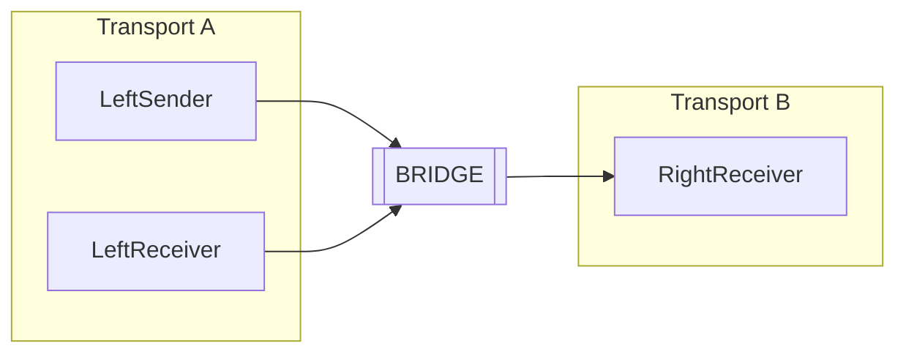
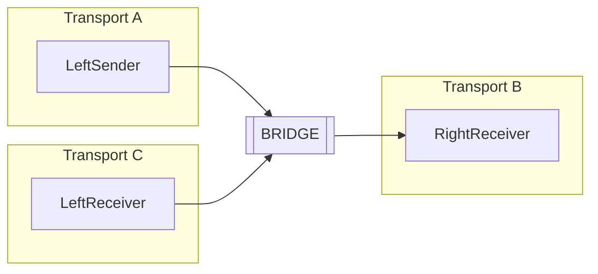

This sample demonstrates how to configure an NServiceBus bridge that forwards messages between two endpoints running on different transports.

For this sample to work without installing any prerequisites, all endpoints use the [LearningTransport](/transports/learning/). To demonstrate that it can still bridge different transports, the LearningTransport on one side of the bridge is configured to store messages in a different location on disk.
This sample uses [LearningTransport](/transports/learning/) with separate StorageDirectory paths to simulate endpoints running on two different transports. This approach allows you to test cross-transport messaging behavior locally, without setting up multiple transport infrastructures.

## Projects

This sample shows how messages are sent from one endpoint to another via a bridge. It includes a response message and a published event, all routed through the bridge. The sample starts by sending a message from one endpoint, LeftSender, to another, RightReceiver. RightReceiver then replies with an `OrderResponse` message. LeftSender handles this message and publishes an `OrderReceived` message which is handled by another endpoint, LeftReceiver, as well as RightReceiver.

Here is a diagram of the message flow:

The projects are named this way to indicate which side of the bridge they exist. LeftSender and LeftReceiver are on one side of the bridge and RightReceiver is on the other. Both sides use the LearningTransport but RightReceiver uses a separate file location, which the sample does to mimic a separate transport than the one used by LeftSender and LeftReceiver.

The transport on either side can be modified to any supported transport. This also requires updating the bridge configuration (described later) but does _not_ require any changes to endpoints on the other side of the bridge. For example, if RightReceiver is changed to use the [RabbitMQ transport](/transports/rabbitmq/), no changes are required to either LeftSender or LeftReceiver; only the bridge configuration needs to be updated to use the new transport for the corresponding endpoint.

Here is a description of each project.

### Bridge

The project that references `NServiceBus.MessagingBridge` and contains configuration to bridge the two transports.

### SharedMessages

The shared message contracts used by all endpoints. It also includes a helper class to find the storage location for the LearningTransport.

### LeftSender

* Launches the message flow by sending a `PlaceOrder` command message to `RightReceiver`.
* Receives and handles `OrderResponse` messages.
* Publish an `OrderReceived`  message.

### RightReceiver

* Receives and handles `PlaceOrder` commands and replies with an `OrderResponse` message.
* Receives and handles `OrderReceived` events.

### LeftReceiver

* Receives and handles `OrderReceived` events.

## Code walk-through

The sample uses the LearningTransport on both sides of the bridge. To simulate two different transports, the location on disk for the LearningTransport on the right side of the bridge is configured to use a different location on disk.

snippet: alternative-learning-transport

### Bridge configuration

Every endpoint that is available in the system must be configured in the bridge. This section shows different ways in which endpoints can be configured.

#### LeftSender

The `LeftSender` endpoint is an endpoint without subscriptions to any event and is the easiest to configure.

snippet: endpoint-adding-simple

#### LeftReceiver

The `LeftReceiver` endpoint is a subscriber to `LeftSender`, but it does not need to cross the bridge. That is, the bridge does not need to know about the `LeftReceiver` endpoint; no configuration is necessary.

#### RightReceiver

The `RightReceiver` endpoint is configured as a new endpoint and the event `Messages.Events.OrderPlaced` is registered on the publisher, `LeftReceiver`, using the fully-qualified name. This is how events are registered if a message assembly cannot be shared with the bridge.

snippet: endpoint-adding-register-publisher-by-string

If an event assembly can be referenced directly by the bridge, the events can be registered by type, as [described in documentation](/nservicebus/bridge/configuration.md#registering-publishers), to prevent typing mistakes. Registering by type is possible in this sample, as the `Shared` assembly has no references to any version of NServiceBus and message types are registered using [conventions](/nservicebus/messaging/conventions.md). For demo purposes the name was added as a string.

#### Add endpoints to bridge configuration

The last step is to register all the configured transports with the bridge itself

snippet: add-transports-to-bridge

## Migrating an endpoint

As an exercise, it is possible to move the `LeftReceiver` to yet another transport. With the learning transport, this is configured by specifying a separate file location, similar to how the `RightReceiver` is configured.

The bridge also must be configured so that a new `BridgeTransport` is added with the already existing `leftReceiver` on the new `BridgeTransport`. The end result looks like this:

