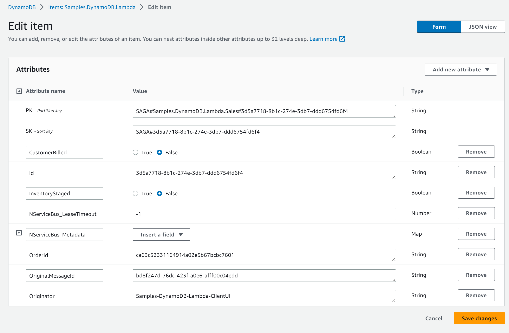

This sample shows a basic Saga using AWS Lambda with SQS and DynamoDB.

downloadbutton

## Prerequisites

The sample includes a [`CloudFormation`](https://aws.amazon.com/cloudformation/aws-cloudformation-templates/) template, which will deploy the Lambda function and create the necessary queues to run the sample.

The [`Amazon.Lambda.Tools` CLI](https://github.com/aws/aws-lambda-dotnet) can be used to deploy the template to an AWS account.

1. Install the [`Amazon.Lambda.Tools CLI`](https://github.com/aws/aws-lambda-dotnet#amazonlambdatools)
1. Make sure an S3 bucket is available in the AWS region of choice

## Running the sample

INFO: It is not possible at this stage to use the AWS .NET Mock Lambda Test Tool to run the sample locally.

Run the following command from the `Sales` directory to deploy the Lambda project:

`dotnet lambda deploy-serverless`

The deployment will ask for a stack name and an S3 bucket name to deploy the serverless stack.

After that, running the sample will launch a single console window:

* **ClientUI** is a console application that will send a `PlaceOrder` command to the `Samples.DynamoDB.Lambda.Sales` endpoint, which is monitored by the AWS Lambda.
* The deployed **Sales** project will receive messages from the `Samples.DynamoDB.Lambda.Sales` queue and process them using the AWS Lambda runtime.

To try the AWS Lambda:

1. From the **ClientUI** window, press <kbd>Enter</kbd> to send a `PlaceOrder` message to the trigger queue.
2. The AWS Lambda will receive the `PlaceOrder` message and will start the `OrderSaga`.
3. The `OrderSaga` will publish an `OrderReceived` event.
4. The AWS Lambda receives the `OrderReceived` event which is handled by the `BillCustomerHandler` and the `StageInventoryHandler`. After a delay, each handler publishes an event, `CustomerBilled` and `InventoryStaged` respectively.
5. The AWS Lambda will receive the events. Once both events are received, the `OrderSaga` publishes an `OrderShipped` event.
6. The **ClientUI** will handle the `OrderShipped` event and log to the console.

## Code walk-through

The **ClientUI** console application is an Amazon SQS endpoint that sends `PlaceOrder` commands and handles the `OrderShipped` event.

The **Sales** project is hosted using AWS Lambda. The static NServiceBus endpoint must be configured using details that come from the AWS Lambda `ILambdaContext`. Since that is not available until a message is handled by the function, the NServiceBus endpoint instance is deferred until the first message is processed, using a lambda expression such as:

snippet: EndpointSetup

The same class defines the AWS Lambda, which hosts the NServiceBus endpoint. The `ProcessOrder` method hands off processing of the message to NServiceBus:

snippet: FunctionHandler

Meanwhile, the `OrderSaga`, hosted within the AWS Lambda project, is a regular NServiceBus Saga which is also capable of sending messages receiving messages itself.

snippet: OrderSaga

The saga data is stored in the `Samples.DynamoDB.Lambda` table and can be inspected via the AWS web portal:

## Removing the sample stack

To remove the deployed stack enter:

`dotnet lambda delete-serverless`

and provide the previously chosen stack name.
