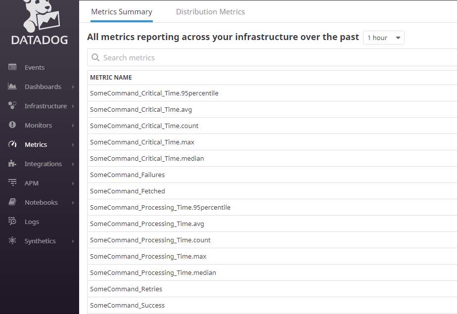

## Introduction

This sample demonstrates how to capture, store, and visualize NServiceBus metrics in Datadog, a monitoring solution for storing application performance data.

This sample reports the following metrics to Datadog:

 * Fetched messages per second 
 * Failed messages per second
 * Successful messages per second
 * Critical time in seconds
 * Processing time seconds
 * Retries

For a detailed explanation of these metrics refer to the [metrics captured section in the metrics documentation](/monitoring/metrics/definitions.md) section.

## Prerequisites

To run this sample, [create a Datadog account](https://app.datadoghq.com/signup), then download and run the Datadog agent.
See the [Introduction to Datadog](https://docs.datadoghq.com/getting_started/) guide for information on how to get started with Datadog metrics.

## Code overview

The sample simulates messages load with a random 10% failure rate using the `LoadSimulator` class: LoadSimulator

## Capturing metric values

Setup Datadog client. Let' s assume the Datadog agent runs on default address and port.

snippet: setup-datadog-client

Custom observers need to be registered for the metric probes provided via `NServiceBus.Metrics`. This is configured in the `DatadogFeature`. The registered observers convert NServiceBus.Metric *Signals* to Datadog *Count* and NServiceBus.Metric *Durations* to Datadog *Timer* 

snippet: datadog-enable-nsb-metrics

## Dashboard

### Create

Dashboards can be created by using Datadog.
