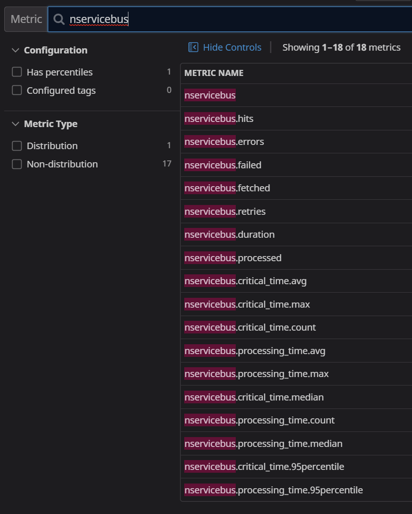
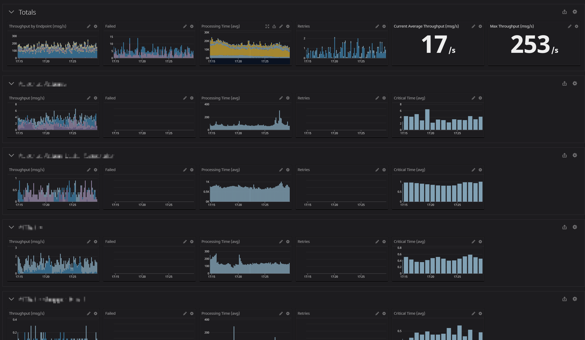
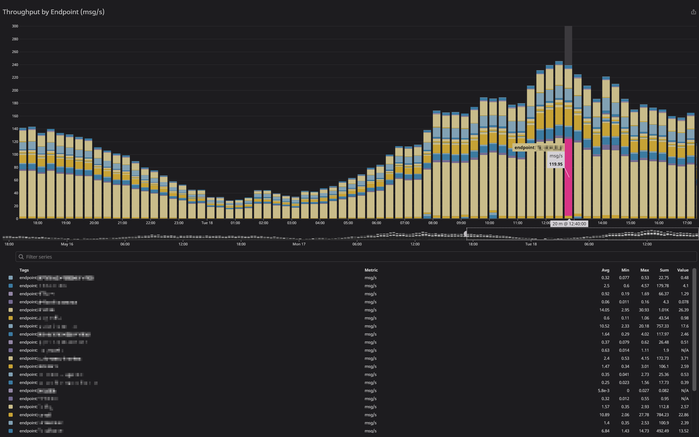
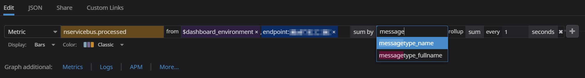

## Introduction

This sample demonstrates how to capture, store, and visualize NServiceBus metrics in Datadog, a monitoring solution for storing application performance data.

This sample reports the following metrics to Datadog:

 * Fetched messages per second 
 * Failed messages per second
 * Successful messages per second
 * Critical time in seconds
 * Processing time seconds
 * Retries

For a detailed explanation of these metrics refer to the [metrics captured section in the metrics documentation](/monitoring/metrics/definitions.md) section.

## Prerequisites

To run this sample, [create a Datadog account](https://app.datadoghq.com/signup), then download and run the Datadog agent.
See the [Introduction to Datadog](https://docs.datadoghq.com/getting_started/) guide for information on how to get started with Datadog metrics.

## Code overview

The sample simulates messages load with a random 10% failure rate using the `LoadSimulator` class: LoadSimulator

## Capturing metric values

Setup Datadog client. Let' s assume the Datadog agent runs on default address and port.

snippet: setup-datadog-client

Custom observers need to be registered for the metric probes provided via `NServiceBus.Metrics`. This is configured in the `DatadogFeature`. The registered observers convert NServiceBus.Metric *Signals* to Datadog *Count* and NServiceBus.Metric *Durations* to Datadog *Timer* 

snippet: datadog-enable-nsb-metrics

## Dashboard

### Available metrics

The following metrics are available across all endpoints. Use the tagged values `endpoint`, `messagetype_name`, and `messagetype_fullname` to aggregate and filter a metric.

### Sample dashboard

This dashboard replicates a lot of the data displayed by ServicePulse. However, DataDog affords a much longer history to draw from.

### Detailed timeseries example

This is a zoomed-in example of a single timeseries component. It displays the message throughput for the entire system, with each bar color-coded by endpoint name.

Hovering over a section shows the details of the related endpoint.

e.g. `sum:nservicebus.processed{$dashboard_environment} by {endpoint}.as_rate().rollup(sum, 1)`

### Timeseries configuration

A specific endpoint or message type for the metric can be pinpointed in the `from` setting, then optionally the metric can be broken down by another facet. In this example, the displayed `nservicebus.processed` metric for just the specified endpoint can then use the `sum by` to show individual sums by message type.

