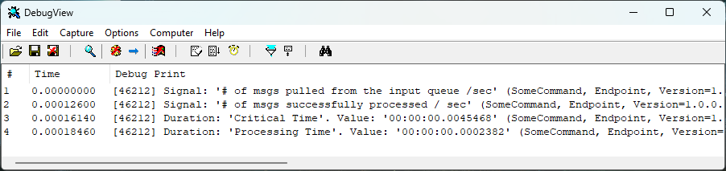

This sample demonstrates how to write [metrics](/monitoring/metrics) information to the trace log.

There are many ways to look at the trace log. One way is to use the [DbgView utility provided by Sysinternals](https://docs.microsoft.com/en-us/sysinternals/downloads/debugview).

## Running the sample

 1. Run the solution in the Visual Studio debugger. A console application will start.
 1. Press the 'enter' key to send a message.
 1. Check the Visual Studio debug output window for metrics information being written to the trace log.

## Sending metrics data to Trace Log

snippet: EnableMetricTracing
