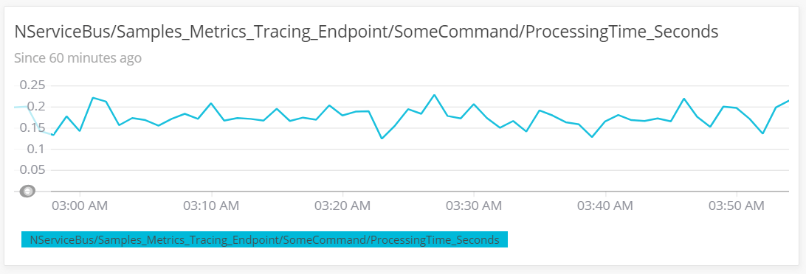
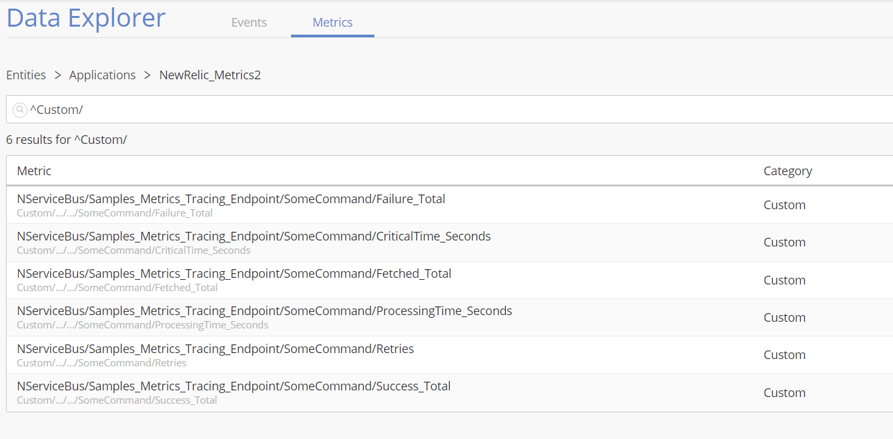
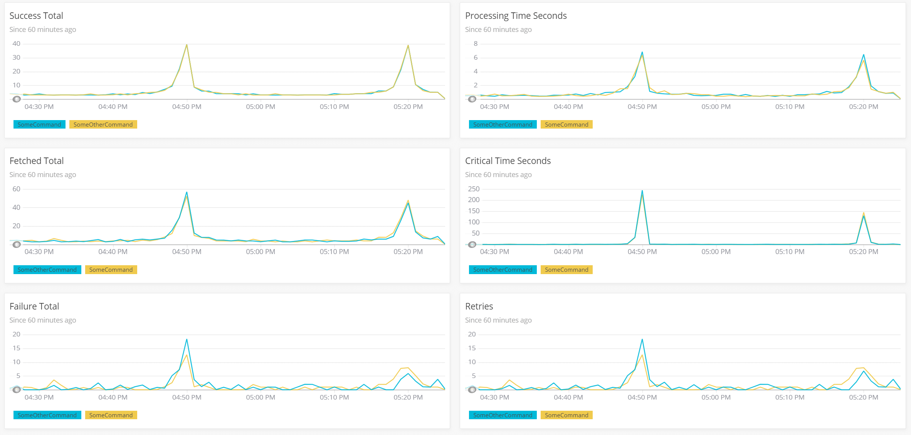

## Introduction

[NewRelic](https://newrelic.com/) is a monitoring solution for storing application performance data, custom events, etc. This sample demonstrates how to capture, store and visualize NServiceBus metrics in NewRelic.

This sample reports the following metrics to NewRelic:

 * Fetched messages per second 
 * Failed messages per second
 * Successful messages per second
 * Critical time in seconds
 * Processing time seconds
 * Retries in Version 2 and later

For a detailed explanation of these metrics refer to the [metrics captured section in the metrics documentation](/nservicebus/operations/metrics/#metrics-captured) section.

## Prerequisites

To run this sample, [create a NewRelic account](https://newrelic.com/signup?via=login), then download and run the NewRelic agent.
See the [Introduction to New Relic Insights](https://docs.newrelic.com/docs/insights/use-insights-ui/getting-started/introduction-new-relic-insights) guide for information on how to get started with NewRelic monitoring.

## Code overview

The sample simulates messages load with a random 10% failure rate using the `LoadSimulator` class:

snippet: newrelic-load-simulator

## Capturing metric values

Custom observers need to be registered for the metric probes provided via `NServiceBus.Metrics`. This is configured in the `NewRelicFeature`:

snippet: newrelic-enable-nsb-metrics

The names provided by the `NServiceBus.Metrics` probes do not follow the naming conventions recommended by NewRelic. The names can be aligned with the [naming conventions defined by NewRelic](https://docs.newrelic.com/docs/agents/manage-apm-agents/agent-data/collect-custom-metrics) using the following mapping:

snippet: newrelic-name-mapping

The registered observers convert NServiceBus.Metric *Signals* to NewRelic *ResponseTimeMetric* and NServiceBus.Metric *Durations* to NewRelic *Metrics*.

snippet: newrelic-register-probe
During the metric registration the following steps are required:

 * Map metric names including the endpoint name and message type, if available
 * Register observer callbacks
 * Record response times and metrics in the observer callback

snippet: newrelic-observers-registration

The NewRelic agent needs to be configured to monitor the application by modifying the `app.config` file:

snippet: newrelic-appname

## Dashboard

### Create

Dashboards can be created by using NewRelic Insights. The following steps have to be performed:

 * Create a new dashboard by using the `Create a dashboard` button under `All Dashboards`.
 * Open up the Data Explorer, select the corresponding application name and filter for `Custom` metrics.
 * Click the custom metric to be added and click on `Add to an Insights dashboard` to add the metric to the previously created dashboard
 * Edit titles if desired

### Samples

