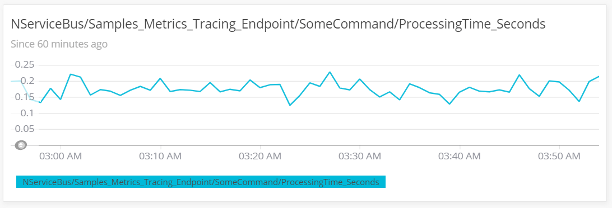
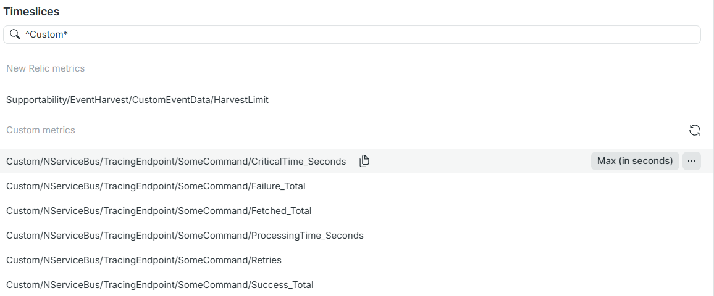

## Introduction

This sample demonstrates how to capture, store, and visualize NServiceBus metrics in [NewRelic](https://newrelic.com/), a monitoring solution for storing application performance data, custom events, etc.



This sample reports the following metrics to NewRelic:

* Fetched messages per second
* Failed messages per second
* Successful messages per second
* Critical time in seconds
* Processing time seconds
* Retries

For a detailed explanation of these metrics, refer to the [metrics captured section](/monitoring/metrics/definitions.md#metrics-captured) of the metrics definitions documentation.

## Prerequisites

To run this sample, [create a NewRelic account](https://newrelic.com/signup?via=login), then download and run the NewRelic agent.

See the [Introduction to New Relic](https://docs.newrelic.com/docs/new-relic-solutions/get-started/intro-new-relic/) guide for information on how to get started with NewRelic monitoring.

## Code overview

The sample uses the `LoadSimulator` class to simulate a workload where 10% of the messages fail:

snippet: newrelic-load-simulator

## Capturing metric values

Custom [observers](/monitoring/metrics/raw.md#reporting-metrics-data-to-any-external-storage) need to be registered for the metric probes provided via the `NServiceBus.Metrics` package:

snippet: newrelic-enable-nsb-metrics

The names provided by the `NServiceBus.Metrics` probes do not follow the naming conventions recommended by NewRelic. The names can be aligned with the [naming conventions defined by NewRelic](https://docs.newrelic.com/docs/agents/manage-apm-agents/agent-data/collect-custom-metrics) using the following mapping:

snippet: newrelic-name-mapping

The registered observers convert NServiceBus.Metric *Signals* to NewRelic *ResponseTimeMetrics* and NServiceBus.Metric *Durations* to NewRelic *Metrics*.

snippet: newrelic-register-probe

During the metric registration, the following steps are required:

* Map metric names including the endpoint name and message type, if available
* Register observer callbacks
* Record response times and metrics in the observer callback

snippet: newrelic-observers-registration

The NewRelic agent needs to be configured to monitor the application by modifying the `app.config` file:

snippet: newrelic-appname

## Dashboard

The [official New Relic NServiceBus integration](https://newrelic.com/instant-observability/nservicebus) provides a quickstart with a pre-built dashboard and alert policies. The quickstart dashboard displays standard .NET APM metrics such as transaction throughput, error rates, and VM resource utilization. It does not display the custom NServiceBus metrics reported by this sample.

### Create a custom dashboard

To visualize the custom NServiceBus metrics reported by this sample, create a dashboard in [New Relic One](https://one.newrelic.com) using NRQL queries:

1. Navigate to **All capabilities** > **Dashboards**.
1. Click **+ Create a dashboard** and select **Create a new dashboard**.
1. Add a chart by clicking **+ Add widget** and selecting **Add a chart**.
1. Query the custom metrics using NRQL. Start by typing `Custom` in the search bar. As an example, the following query returns a processing time chart:

   ```sql
   SELECT average(newrelic.timeslice.value)
   FROM Metric
   WHERE appName = 'NewRelicSample'
     AND metricTimesliceName LIKE 'Custom/NServiceBus/TracingEndpoint/%/ProcessingTime_Seconds'
   TIMESERIES
   ```

   Use `metricTimesliceName LIKE 'Custom/NServiceBus/TracingEndpoint/%'` to browse all metrics sent by the sample. See the [New Relic documentation on querying APM metric timeslice data](https://docs.newrelic.com/docs/data-apis/understand-data/metric-data/query-apm-metric-timeslice-data-nrql/) for more details.
1. Click **Run** to preview the chart, then **Save** to add it to the dashboard.

To list all the metrics in the sample, go to **Data Explorer** within the **Add Widget** wizard, select **Timeslices** and type:`^Custom/`.

