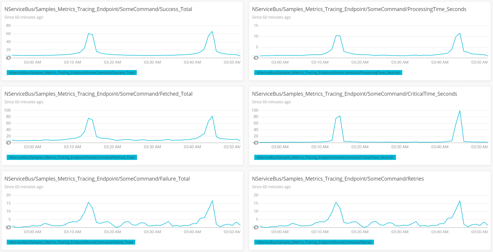

## Introduction

This sample demonstrates how to capture, store, and visualize NServiceBus metrics in [NewRelic](https://newrelic.com/), a monitoring solution for storing application performance data, custom events, etc.

This sample reports the following metrics to NewRelic:

* Fetched messages per second
* Failed messages per second
* Successful messages per second
* Critical time in seconds
* Processing time seconds
* Retries

For a detailed explanation of these metrics, refer to the [metrics captured section](/monitoring/metrics/definitions.md#metrics-captured) of the metrics definitions documentation.

The [New Relic NServiceBus integration](https://newrelic.com/instant-observability/nservicebus/f3f28a00-8cea-41f1-a6fe-ebf5eae5791e) can be used to get started quickly.

## Prerequisites

To run this sample, [create a NewRelic account](https://newrelic.com/signup?via=login), then download and run the NewRelic agent.

See the [Introduction to New Relic Insights](https://docs.newrelic.com/docs/insights/use-insights-ui/getting-started/introduction-new-relic-insights) guide for information on how to get started with NewRelic monitoring.

## Code overview

The sample uses the `LoadSimulator` class to simulate a workload where 10% of the messages fail:

snippet: newrelic-load-simulator

## Capturing metric values

Custom [observers](/monitoring/metrics/raw.md#reporting-metrics-data-to-any-external-storage) need to be registered for the metric probes provided via the `NServiceBus.Metrics` package:

snippet: newrelic-enable-nsb-metrics

The names provided by the `NServiceBus.Metrics` probes do not follow the naming conventions recommended by NewRelic. The names can be aligned with the [naming conventions defined by NewRelic](https://docs.newrelic.com/docs/agents/manage-apm-agents/agent-data/collect-custom-metrics) using the following mapping:

snippet: newrelic-name-mapping

The registered observers convert NServiceBus.Metric *Signals* to NewRelic *ResponseTimeMetrics* and NServiceBus.Metric *Durations* to NewRelic *Metrics*.

snippet: newrelic-register-probe

During the metric registration, the following steps are required:

* Map metric names including the endpoint name and message type, if available
* Register observer callbacks
* Record response times and metrics in the observer callback

snippet: newrelic-observers-registration

The NewRelic agent needs to be configured to monitor the application by modifying the `app.config` file:

snippet: newrelic-appname

## Dashboard

A ready-to-use dashboard is available in the [official New Relic NServiceBus integration](https://newrelic.com/instant-observability/nservicebus/f3f28a00-8cea-41f1-a6fe-ebf5eae5791e).

### Create a custom dashboard

Custom dashboards can be created by using NewRelic Insights. The following steps have to be performed:

* Create a new dashboard by using the `Create a dashboard` button under `All Dashboards`.
* Open up the Data Explorer, select the corresponding application name and filter for `Custom` metrics.
* Click the custom metric to be added and click on `Add to an Insights dashboard` to add the metric to the previously created dashboard
* Edit titles if desired

### Samples

