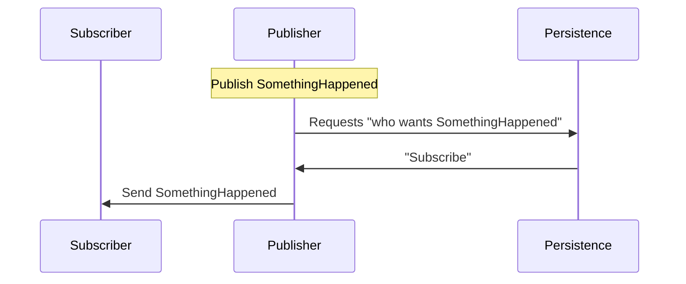
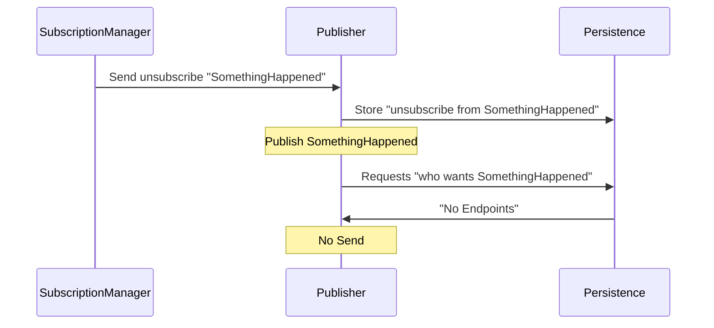

This sample shows how to manually remove subscriptions when subscribers are decommissioned. The solution comprises of 4 projects.

WARNING: While this sample uses the [MSMQ transport](/transports/msmq), the concepts shown are valid for all transports based on message driven subscriptions. The approach shown in this sample is not applicable to transports that support native pub/sub. For more information see [Publish-Subscribe](/nservicebus/messaging/publish-subscribe/).

## Running the sample

### Initial State

Run the sample and all three endpoints will start.

Subscriber initially subscribes to the `SomethingHappened` message in Publisher.

### Publish event

Hit `enter` in Publisher and a `SomethingHappened` will be published via the following process:

The `SomethingHappened` event will be received by Subscriber.

### Unsubscribe

Hit enter on SubscriptionManager. A `ManualUnsubscribe` message for `SomethingHappened` will be sent to Publisher.

Now hit `enter` in Publisher and no `SomethingHappened` will be published.

## Solution structure

### Subscriber

A sample endpoint subscribed to an event that will be published by `Publisher`:

snippet: event-handler

### Publisher

#### The publisher configuration

snippet: publisher-config

This specific sample is configured to use [MSMQ Subscription Persistence](/persistence/msmq/).

#### Subscriber decommissioning

In such a configuration, when a subscriber endpoint is decommissioned it may happen that subscriptions remain stored at the publisher. Publishers have no way to detect that a subscriber is no longer available. They will continue to publish events even for subscribers that no longer exist. This behavior will eventually lead to storage and quota issues.

To remove a subscription a message can be sent to the publisher:

snippet: unsubscribe-message

#### Unsubscribe process

The Publisher handles the `ManualUnsubscribe` message. This handling consists of three parts:

#### 1. Handler

The `IHandleMessages<ManualUnsubscribe>` implementation.

snippet: unsubscribe-handling

The message handler relies on the `ISubscriptionStorage` NServiceBus abstraction to perform the unsubscribe request regardless of the subscription storage configured for the publisher.

#### 2. Query persistence for subscriptions

The handler then query the persistence for all subscriptions that match the message type and endpoint name.

snippet: GetAddressesForEndpoint

#### 3. Unsubscribe

The handler then communicates the unsubscribe actions with the persistence. 

snippet: UnsubscribeFromEndpoint

### SubscriptionManager

`SubscriptionManager` is a sample endpoint instance that can be used by operations or DevOps personnel to send unsubscribe requests to publishers whenever a subscriber is decommissioned:

snippet: SubscriptionManager-config

NOTE: This sample uses a stand alone [send-only endpoint](/nservicebus/hosting/#self-hosting-send-only-hosting) to send the unsubscribe message. However that message could also be sent from any endpoint, process, or script that has the knowledge of the endpoint and message to unsubscribe from.

### Messages

The shared messages and events used by this sample.
