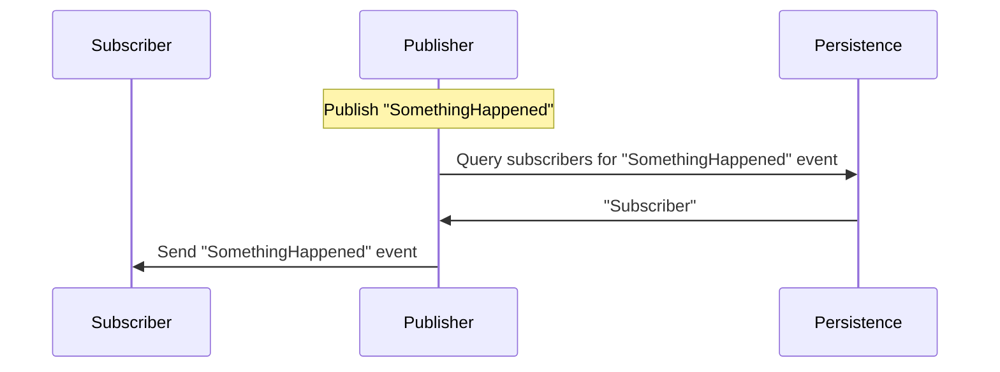
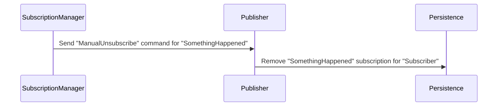
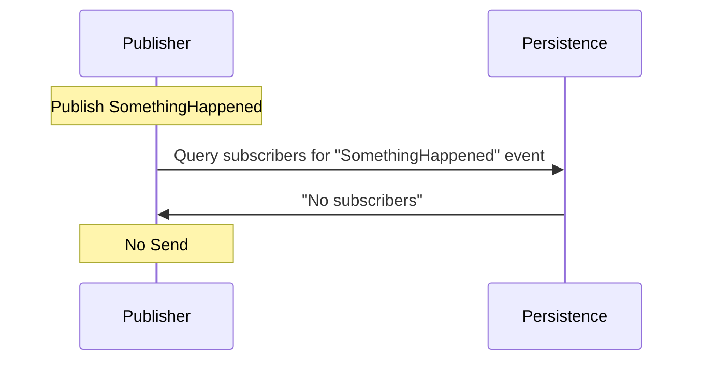

This sample shows how to remove subscriptions from message transports that do not have native pub/sub support.

> [!NOTE]
> While this sample uses the [MSMQ transport](/transports/msmq), the concepts shown are valid for all transports based on message-driven subscriptions except those that support native pub/sub. For more information see [Publish-Subscribe](/nservicebus/messaging/publish-subscribe/).

## Running the sample

### Initial State

Run the sample and the three endpoints (`SubscriptionManager`, `Subscriber`, and `Publisher`) will start.

`Subscriber` initially subscribes to the `SomethingHappened` message in `Publisher`.

### Publish event

Hit `enter` in `Publisher` and a `SomethingHappened` event will be published via the following process:

The publisher queries the persistence to see if there are any subscribers for the event. The persistence returns the list of subscribers for the `SomethingHappened` event, in this case `Subscriber`. `Publisher` sends the `SomethingHappened` event to `Subscriber`.

### Unsubscribe

Hit `enter` on `SubscriptionManager`. A `ManualUnsubscribe` command for `SomethingHappened` will be sent to `Publisher`.

Now hit `enter` in `Publisher`. The publisher queries the persistence to see if there are any subscribers for the event. The persistence returns no subscribers. `SomethingHappened` will *not* be published to any endpoints.

## Sample solution structure

### Subscriber

An endpoint subscribed to an event that will be published by `Publisher`:

snippet: event-handler

### Publisher

#### The publisher configuration

snippet: publisher-config

This sample is configured to use [MSMQ Subscription Persistence](/persistence/msmq/).

#### Subscriber decommissioning

Publishers have no way to detect that a subscriber is no longer available when a subscriber endpoint is decommissioned. If subscriptions aren't removed, publishers will continue to publish events even for subscribers that no longer exist. This behavior will eventually lead to storage and quota issues.

To remove a subscription, send a `ManualUnsubscribe` message to the `Publisher` from the `SubscriptionManager` by hitting `enter`:

snippet: unsubscribe-message

#### Unsubscribe process

The `Publisher` handles the `ManualUnsubscribe` message. This handling consists of three parts: `Handler`, `Persistence`, and `Unsubscribe`.

##### 1. Handler

The `ManualUnsubscribeHandler` message handler relies on the `ISubscriptionStorage` NServiceBus abstraction to perform the unsubscribe request regardless of the subscription storage configured for the publisher.

snippet: unsubscribe-handling

##### 2. Persistence

The handler then queries the persistence for all subscriptions that match the message type and endpoint name.

snippet: GetAddressesForEndpoint

##### 3. Unsubscribe

The handler then removes the subscription from the persistence.

snippet: UnsubscribeFromEndpoint

### SubscriptionManager

`SubscriptionManager` is an endpoint instance that can be used to send unsubscribe requests to publishers whenever a subscriber is decommissioned:

snippet: SubscriptionManager-config

> [!NOTE]
> This sample uses a stand alone [send-only endpoint](/nservicebus/hosting/#self-hosting-send-only-hosting) to send the unsubscribe message. However that message could also be sent from any endpoint, process, or script that has the knowledge of the endpoint and message to unsubscribe from.

### Messages

The project contains the shared messages and events used by this sample.
