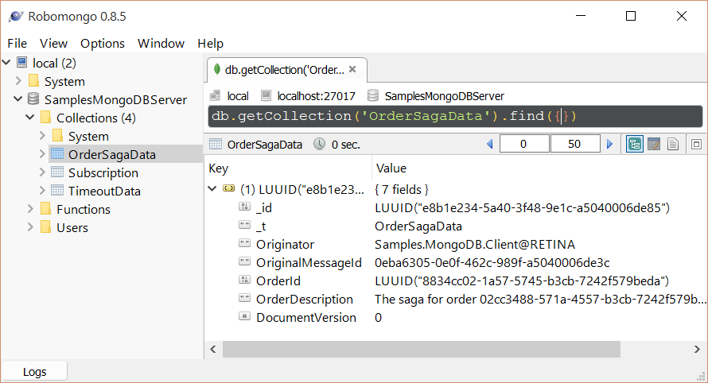
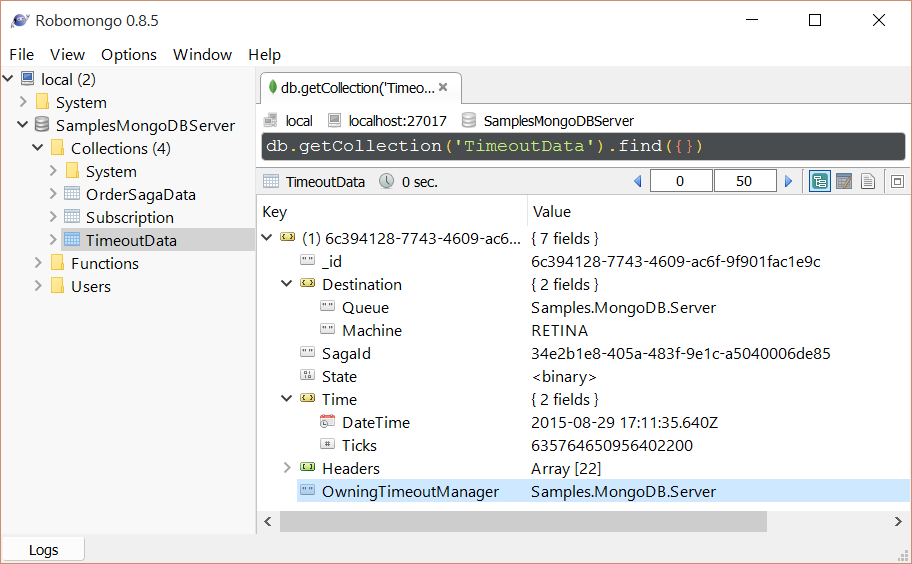
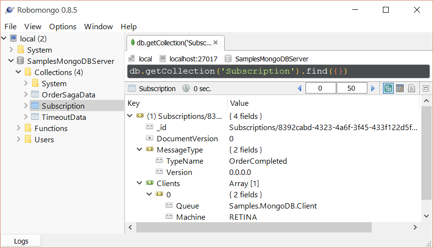

## Prerequisites

Ensure an instance of [MongoDB](https://www.mongodb.com/) is running on `localhost:27017`. See [Install MongoDB on Windows](https://docs.mongodb.com/manual/tutorial/install-mongodb-on-windows/).

### MongoDB Management UI

To visualize the data in MongoDB it is useful to have install a [MongoDB administration tool](https://docs.mongodb.com/ecosystem/tools/). The screen shots shown in this sample use [Robomongo](https://robomongo.org/).

## Code walk-through

This sample shows a simple Client + Server scenario.

 * `Client` sends a `StartOrder` message to `Server`
 * `Server` starts an `OrderSaga`.
 * `OrderSaga` requests a timeout with a `CompleteOrder` data.
 * When the `CompleteOrder` timeout fires the `OrderSaga` publishes a `OrderCompleted` event.
 * The Server then publishes a message that the client subscribes to.
 * `Client` handles `OrderCompleted` event.

### MongoDB configuration

The `Server` endpoint is configured to use the MongoDB persistence with a connection string of `mongodb://localhost:27017/SamplesMongoDBServer`.

snippet: MongoDBConfig

### Order Saga Data

`NServiceBus.Persistence.MongoDB` [requires a property on the saga decorated with attribute `[DocumentVersion]`, usually named Version](https://github.com/tekmaven/NServiceBus.Persistence.MongoDB/#saga-definition-guideline).

snippet: sagadata

### Order Saga

snippet: thesaga

## The Data in MongoDB

The data in MongoDB is stored in three different collections.

### The Saga Data

 * `IContainSagaData.Id` maps to the native MongoDB document `_id`
 * `IContainSagaData.Originator` and `IContainSagaData.OriginalMessageId` map to simple properties pairs.
 * Custom properties on the SagaData, in this case `OrderDescription` and `OrderId`, are also mapped to simple properties.
 * `_t` is type serialization metadata use by the underlying MongoDB Driver.
 * `DocumentVersion` used by `NServiceBus.Persistence.MongoDB` to prevent concurrency issues.

### The Timeouts

 * The subscriber is stored in a `Destination` with the nested properties `Queue` and `Machine`.
 * The endpoint that initiated the timeout is stored in the `OwningTimeoutManager` property
 * The connected saga ID is stored in a `SagaId` property.
 * The serialized data for the message is stored in a `State` property.
 * The scheduled timestamp for the timeout is stored in a `Time` property.
 * Any headers associated with the timeout are stored in an array of key value pairs.

### The Subscriptions

Note that the message type maps to multiple subscriber endpoints.

 * The Subscription message type and version are stored as a composite key in the MongoDB document `_id` property.
 * The list of subscribers is stored in a array of strings containing `Queue@MachineName` values.

