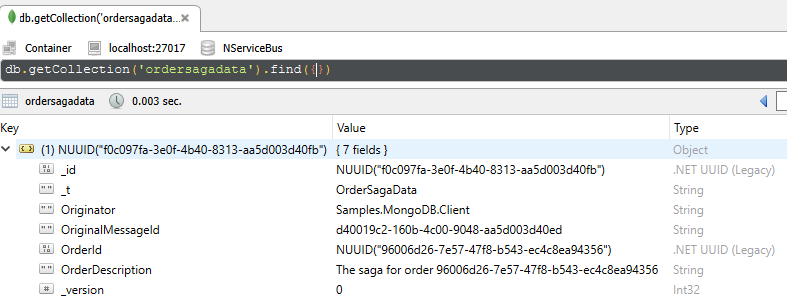

## Prerequisites

Ensure an instance of [MongoDB](https://www.mongodb.com/) is running on `localhost:27017`. See [Install MongoDB on Windows](https://docs.mongodb.com/manual/tutorial/install-mongodb-on-windows/).

### MongoDB management UI

To visualize the data in MongoDB, it is useful to install a [MongoDB administration tool](https://docs.mongodb.com/ecosystem/tools/). The screen shots shown in this sample use [Robomongo](https://robomongo.org/).

## Code walk-through

This sample shows a simple client/server scenario:

 * `Client` sends a `StartOrder` message to `Server`
 * `Server` starts an `OrderSaga`.
 * `OrderSaga` requests a timeout with a `CompleteOrder` data.
 * When the `CompleteOrder` timeout fires the `OrderSaga` publishes an `OrderCompleted` event.
 * `Server` then publishes a message that the client subscribes to.
 * `Client` handles the `OrderCompleted` event.

### MongoDB configuration

The `Server` endpoint is configured to use the MongoDB persistence.

snippet: MongoDBConfig

Unless the mongo url is configured, the persistence will use the default connection string of `mongodb://localhost:27017`. 

Similarly, unless the database name setting is configured, the persistence will use the endpoint name as the database name. In this sample the database name will be `Samples_MongoDB_Server`.

### Order saga

snippet: thesaga

### Saga data

The saga data is stored in the `ordersagadata` collection.

snippet: sagadata

 * `IContainSagaData.Id` maps to the native MongoDB document `_id`
 * `IContainSagaData.Originator` and `IContainSagaData.OriginalMessageId` both map to simple property pairs.
 * Custom properties on the SagaData, in this case `OrderDescription` and `OrderId`, are also mapped to simple properties.
 * `_t` is type serialization metadata used by the underlying MongoDB Driver.
 * `_version` is added and managed by `NServiceBus.Storage.MongoDB` to prevent concurrency issues.

