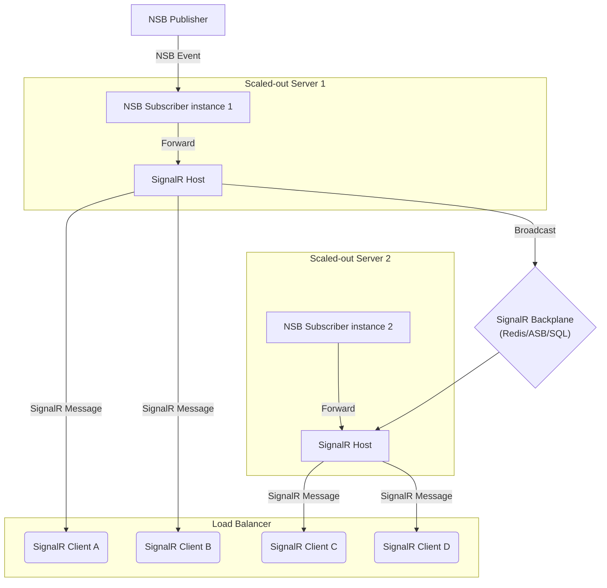

For "near real-time" [occasionally-connected](https://en.wikipedia.org/wiki/Occasionally_connected_computing) clients, messages are only useful for a short period of time. A classic example is stock ticker updates, where the latest prices matter, but old ones quickly become irrelevant.

One of the key features of message queuing is the ability for the receiving endpoints to maintain service even when offline. Messages remain in the queue for processing when the system comes back online. However, while this feature is critical for some systems, the long lasting, durable nature of message queuing can result in a backlog of messages that are no longer relevant for occasionally-connected ones. If the client is disconnected long enough, it can result in queue quotas being exceeded, which in turn can generate exceptions on the message sender and possibly impact other parts of the system.

One way to prevent this is to [unsubscribe](/nservicebus/messaging/publish-subscribe/controlling-what-is-subscribed.md#manually-subscribing-to-a-message) when shutting down. However, this approach is unreliable since a crash could prevent the unsubscribe from happening.

A better solution is to avoid implementing each client as an NServiceBus endpoint. Instead, use a push-based technology like [SignalR](https://signalr.net/) to only send updates when clients are connected.

This sample demonstrates how to use a SignalR server that also acts as an NServiceBus endpoint, to push subscribed NServiceBus events to any connected SignalR clients.

> [!NOTE]
> SignalR can be used in many different ways. For general guidance, check out the official [SignalR tutorials](https://learn.microsoft.com/en-us/aspnet/core/tutorials/signalr?tabs=visual-studio&view=aspnetcore-6.0) and [SignalR samples](https://github.com/aspnet/SignalR-samples). This guide specifically focuses on how to relay NServiceBus events to SignalR clients.

## Solution structure

Before running the sample, review the solution structure, the projects, and the classes.

Projects in the solution:
- `Publisher`: command-line application that hosts an instance of NServiceBus.
- `ClientHub`: command-line application that hosts an instance of NServiceBus and a SignalR server.
- `Client`: command-line application that hosts a SignalR client.
- `StockEvents`: contains the `StockTick` message class

## Sharing message types with SignalR

The `StockEvents` project contains the definition of a message class that is shared with both NServiceBus endpoints, the SignalR hub, and the SignalR client. Open `StockTick` to see the message that will be published by this sample. Note that this event is defined using [unobtrusive mode message conventions](/nservicebus/messaging/unobtrusive-mode.md), allowing the `Client` project, which only uses SignalR, to reference the message type without requiring a reference to NServiceBus.

snippet: MessageConventionsForNonNSB

## Bridging the bus to clients using SignalR

The `ClientHub` project subscribes to the `StockTick` event published by `Publisher`.

`StockTickHub` defines an `async` method - `PushStockTick` - that sends the `StockTick` message to the connected SignalR clients.

snippet: StockTickHub

When the `StockTick` event is handled, it invokes the `PushStockTick` method on the `StockTickHub`.

snippet: StockTickHandler

## Web applications

In this sample, the SignalR client is implemented as a .NET console application. The client could also be implemented using the JavaScript SignalR client hosted in a web application.

## Scaling out SignalR with NServiceBus

When the number of connected clients exceeds the capability of a single SignalR server, scale out the SignalR server. See [Microsoft's ASP.NET Core SignalR hosting and scaling](https://learn.microsoft.com/en-us/aspnet/core/signalr/scale) for details on how to do this.

In this diagram, an NServiceBus event is being processed by [one of the two subscriber instances](/nservicebus/scaling.md#scaling-out-to-multiple-nodes-competing-consumers). `Server 1` is forwarding the NServiceBus event as a SignalR message, which is then broadcast via the configured backplane to `Server 2`'s SignalR server. This allows the connected SignalR clients to receive the message.
