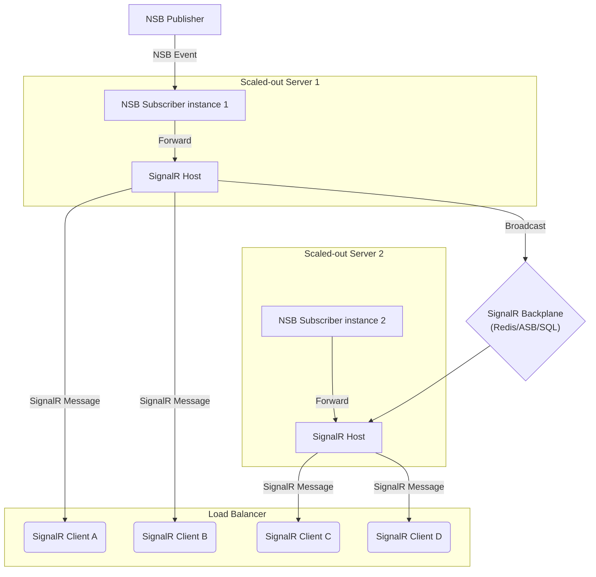

NOTE: SignalR can be used in a variety of ways. Browse the official [SignalR tutorials](https://docs.microsoft.com/en-us/aspnet/core/tutorials/signalr?tabs=visual-studio&view=aspnetcore-2.2) and [SignalR samples](https://github.com/aspnet/SignalR-samples) for information on how to use SignalR. This document focuses on how to relay NServiceBus events to SignalR clients.

For near real-time, occasionally connected clients, messages are only relevant for a short period of time. Clients that received near real-time stock ticker updates are a common example of these types of clients.

One of the basic features of message queuing is the ability for the receiving endpoints to maintain service even when offline.  In this scenario, the long lasting, durable nature of message queuing can result in a backlog of messages that are no longer relevant which, if disconnected long enough, can result in queue quotas being exceeded. This can ultimately result in exceptions on the message sender possibly impacting other parts of the system.

A possible answer is to [unsubscribe](/nservicebus/messaging/publish-subscribe/controlling-what-is-subscribed.md#manually-subscribing-to-a-message) on shutdown. This is a fragile option since the client may not successfully complete the unsubscribe when a crash occurs.

Another solution is to avoid implementing each client as an NServiceBus endpoint, but instead use a push technology, such as [SignalR](https://signalr.net/), to update clients only while they are connected.

This sample demonstrates how to use a SignalR server, which also acts as an NServiceBus endpoint, to push subscribed NServiceBus events to any connected SignalR clients.

## Project structure

Before running the sample, review the solution structure, the projects, and the classes. The `Publisher` and `ClientHub` projects are command-line applications that host an instance of NServiceBus.

The `ClientHub` project also hosts a SignalR server. The `Client` project is a command-line application that hosts a SignalR client.

## Sharing message types with SignalR

The `StockEvents` project contains the definition of a message class that is shared with both NServiceBus endpoints, the SignalR hub, and the SignalR client. Open "StockTick" to see the message that will be published by this sample. Note that this event is defined using [unobtrusive mode message conventions](/nservicebus/messaging/unobtrusive-mode.md), allowing the `Client` project, which only uses SignalR, to reference the message type without requiring a reference to NServiceBus.

snippet: MessageConventionsForNonNSB

## Hosting SignalR with NServiceBus

The sample shows how to host a self-hosted SignalR 2 server side-by-side with an NServiceBus endpoint. For more information on using SignalR Self-Host, see [the SignalR Self-Host tutorial](https://docs.microsoft.com/en-us/aspnet/signalr/overview/deployment/tutorial-signalr-self-host).

## Bridging the bus to clients using SignalR

The `ClientHub` project subscribes to the `StockTick` event published by `Publisher`. 

`StockTickHub` defines an `async` method - `PushStockTick` - that sends the `StockTick` message to the connected SignalR clients.

snippet: StockTickHub

When the `StockTick` event is handled, it invokes the `PushStockTick` method on the `StockTickHub`.

snippet: StockTickHandler

## Web applications

In this sample, the SignalR client is implemented as a .NET console application. The client could also be implemented using the JavaScript SignalR client hosted in a web application.

## Scaling out SignalR with NServiceBus

When the number of connected clients exceeds the capability of a single SignalR server, it will be necessary to scale out the SignalR server. Scaling out SignalR is described in the [Introduction to Scaleout in SignalR](https://docs.microsoft.com/en-us/aspnet/signalr/overview/performance/scaleout-in-signalr) article by Microsoft.

In this diagram an NServiceBus event is being processed by [one of the two subscriber instances](/nservicebus/architecture/scaling.md#scaling-out-to-multiple-nodes-competing-consumers). Server 1 is forwarding the NServiceBus event as a SignalR message, which is then broadcast via the configured backplane to Server 2's SignalR server. This allows the connected SignalR clients to receive the message.
