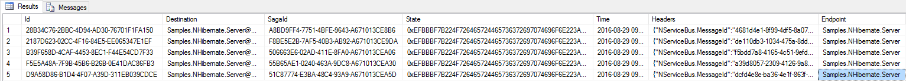
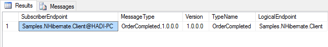

## Prerequisites

The sample relies on `.\SqlExpress` and the existence of a database named `Samples.NHibernate` to run properly.

## Code walk-through

This sample shows a simple client/server scenario.

 * `Client` sends a `StartOrder` message to `Server`.
 * `Server` starts an `OrderSaga`.
 * `OrderSaga` requests a timeout with `CompleteOrder` data.
 * When the `CompleteOrder` timeout fires, the `OrderSaga` publishes a `OrderCompleted` event.
 * `Server` then publishes a message that the client has subscribed to.
 * `Client` handles the `OrderCompleted` event.

### NHibernate config

Configure NHibernate with the right driver, dialect, and connection string. Since NHibernate needs a way to map the class to the database table, the configuration code also does that with ModelMapper API. Finally, the configuration is used to run the endpoint.

snippet: config

### Order saga data

Note that to use NHibernate's lazy-loading, all the properties on the saga data class must be `virtual`.

snippet: sagadata

### Order saga

snippet: ordersaga

### Handler using ISession

The handler access the `ISession` to store business data.

snippet: handler

## The database

The data in the database is stored in three different tables.

### The saga data

 * `IContainSagaData.Id` maps to the OrderSagaData primary-key and unique identifier column `Id`.
 * `IContainSagaData.Originator` and `IContainSagaData.OriginalMessageId` map to columns of the same name of type `varchar(255)`.
 * Custom properties on SagaData, in this case `OrderDescription` and `OrderId`, are also mapped to columns with the same name and the respecting types.

### The timeouts

 * The subscriber is stored in `Destination` column and includes `Queue` and `Machine` information.
 * The endpoint that initiated the timeout is stored in the `Endpoint` column.
 * The connected saga ID is stored in a `SagaId` column.
 * The serialized data for the message is stored in a `State` column.
 * The scheduled timestamp for the timeout is stored in a `Time` column.
 * Any headers associated with the timeout are stored in an array of key value pairs stored in the 'Headers' column.

### The subscriptions

Note that the message type maps to multiple subscriber endpoints.

 * The Subscription message type and version are stored in the `MessageType` column.
 * The list of subscribers is stored in an array of objects each containing `Queue` and `MachineName` information.

### The handler stored data

