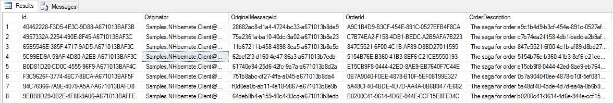
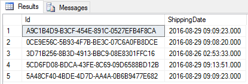

## Prerequisites

The sample relies on `.\SqlExpress` and the existence of a database named `Samples.NHibernate`.

## Code walk-through

This sample shows a simple client/server scenario.

 * `Client` sends a `StartOrder` message to `Server`.
 * `Server` starts an `OrderSaga`.
 * `OrderSaga` requests a timeout with `CompleteOrder` data.
 * When the `CompleteOrder` timeout fires, the `OrderSaga` publishes an `OrderCompleted` event.
 * `Server` then publishes a message that the client has subscribed to.
 * `Client` handles the `OrderCompleted` event.

### NHibernate config

NHibernate is first configured with the right driver, dialect, and connection string. Then, since NHibernate needs a way to map the class to the database table, the configuration code does this using the ModelMapper API. Finally, the configuration is used to run the endpoint.

snippet: config

### Order saga data

Note that to use NHibernate's lazy-loading feature, all properties on the saga data class must be `virtual`.

snippet: sagadata

### Order saga

snippet: ordersaga

### Handler using ISession

The handler uses the `ISession` instance to store business data.

snippet: handler

## The database

Data in the database is stored in three different tables.

### The saga data

 * `IContainSagaData.Id` maps to the OrderSagaData primary key and unique identifier column `Id`.
 * `IContainSagaData.Originator` and `IContainSagaData.OriginalMessageId` map to columns of the same name with type `varchar(255)`.
 * Custom properties on SagaData, in this case `OrderDescription` and `OrderId`, are also mapped to columns with the same name and the respecting types.

### The handler stored data

