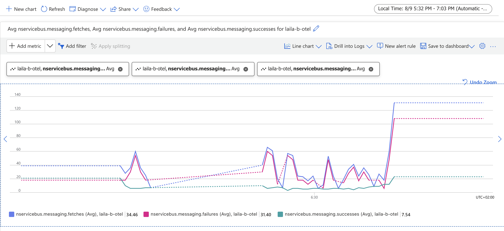
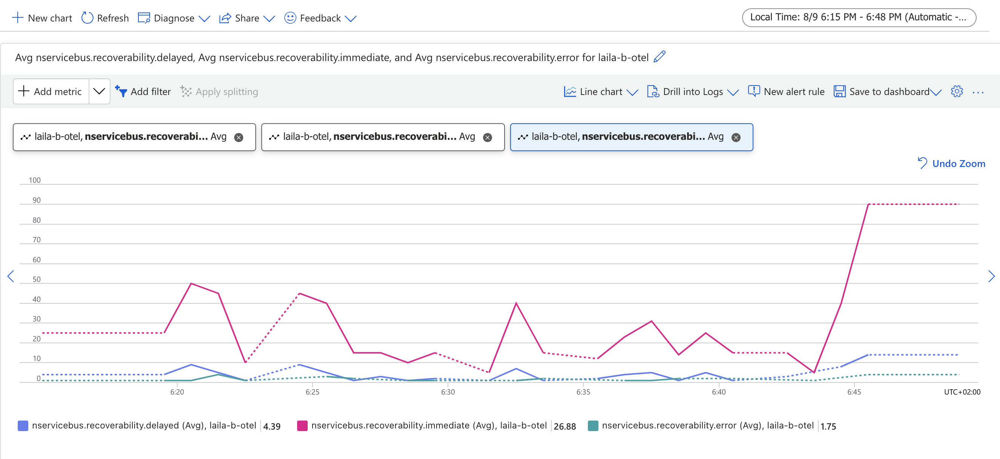
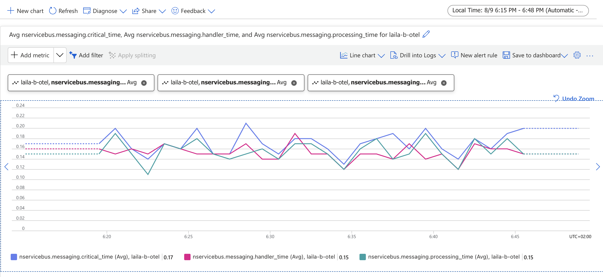

[Azure Application Insights](https://docs.microsoft.com/en-us/azure/azure-monitor/app/app-insights-overview) (App Insights) provides monitoring and alerting capabilities that can be leveraged to monitor the health of NServiceBus endpoints.

This sample shows how to capture NServiceBus OpenTelemetry traces and export them to App Insights. The sample simulates message load as well as a 10% failure rate on processing messages.

## Prerequisites

This sample requires an App Insights connection string.

> [!NOTE]
> Although the sample uses Azure Application Insights, the solution itself does not require an Azure message transport. This example uses the [Learning Transport](/transports/learning/) but could be modified to run on any [transport](/transports/).

## Running the sample

1. Create an Application Insights resource in Azure
2. Copy the connection string from the Azure portal dashboard into the sample
3. Start the sample endpoint
4. Press any key to send a message, or <kbd>ESC</kbd> to quit

### Reviewing traces

1. On the Azure portal dashboard, open the _Investigate_ → _Performance_ panel
2. Drill into the samples
3. Review the custom properties

### Reviewing meters

Navigate to _Monitoring_ → _Metrics_ on the Azure portal dashboard for the configured Application Insight instance to start creating graphs.

> [!NOTE]
> It may take a few minutes for the meter data to populate to Azure. Meters will only appear on the dashboard once they have reported at least one value.

#### Message processing counters

To monitor the rate of messages being fetched from the queuing system, processed successfully, retried, and failed for the endpoint use:

- `nservicebus.messaging.fetches`
- `nservicebus.messaging.successes`
- `nservicebus.messaging.failures`

#### Recoverability

To monitor [recoverability](/nservicebus/recoverability/) metrics use:

- `nservicebus.recoverability.immediate`
- `nservicebus.recoverability.delayed`
- `nservicebus.recoverability.error`

#### Handler time, critical time, and processing time

To monitor [handler time, processing time, and critical time](/monitoring/metrics/definitions.md#metrics-captured) (in seconds) for successfully processed messages use:

- `nservicebus.messaging.handler_time`
- `nservicebus.messaging.processing_time`
- `nservicebus.messaging.critical_time`

## Code walk-through

partial: enableotel

### Tracing

The endpoint configures an OpenTelemetry trace provider that includes the `NServiceBus.Core` source and exports collected traces to Azure Monitor.

snippet: enable-tracing

### Meters

The endpoint configures an OpenTelemetry meter provider that includes the `NServiceBus.Core` meter and exports metric data to Azure Monitor.

snippet: enable-meters

