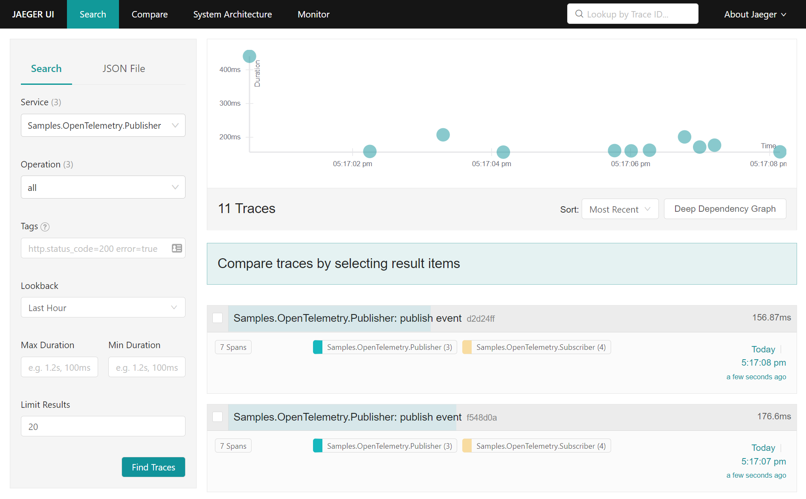
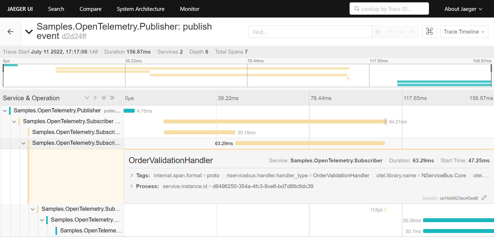

Jaeger is a distributed tracing system for monitoring and troubleshooting distributed systems. This sample demonstrates how to export OpenTelemetry traces from NServiceBus-based systems to Jaeger.

## Prerequisites

A Jaeger instance is required to send, process and view OpenTelemetry trace diagnostics. Use the [`All in one` Jaeger container image](https://www.jaegertracing.io/docs/1.53/getting-started/#all-in-one) for development and testing purpose by running the following docker command:

```
$ docker run --name jaeger \
  -e COLLECTOR_OTLP_ENABLED=true \
  -p 16686:16686 \
  -p 4317:4317 \
  -p 4318:4318 \
  jaegertracing/all-in-one:latest
```

With this default configuration, the Jaeger UI will be available at `http://localhost:16686` and the [OTEL Collector](https://opentelemetry.io/docs/collector/) is set up to listen on the default ports, 4317 (gRPC) 4318 (http).

## Code overview

The sample contains two endpoints exchanging publish-subscribe events and point-to-point messages between each other. To enable tracing and export to Jaeger, the `TraceProvider` for each endpoint has to be configured as follows:

snippet: jaeger-exporter-configuration

partial: enableotel

## Running the sample

Run the sample and press <kbd>1</kbd> on the `Publisher` endpoint to publish one or more events. Navigate to the Jaeger UI (at `http://localhost:16686`) to inspect the captured traces:



Inspecting a selected trace shows the conversation flow between the `Publisher` and the `Subscriber` endpoint:


