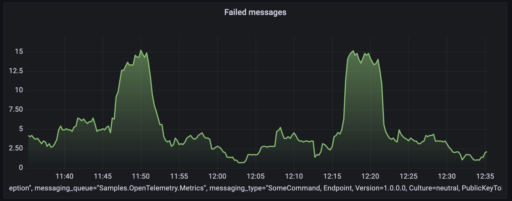
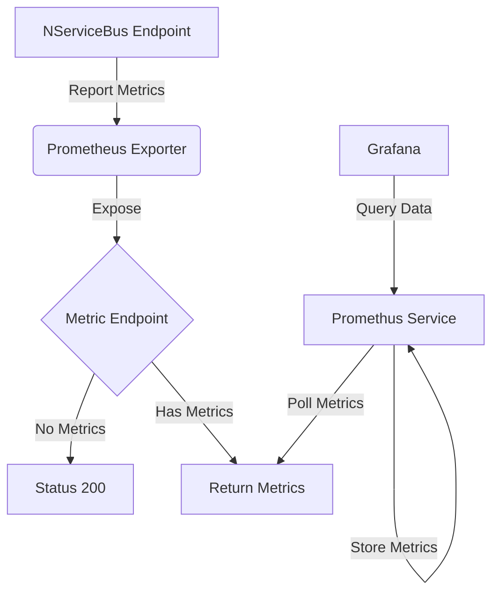
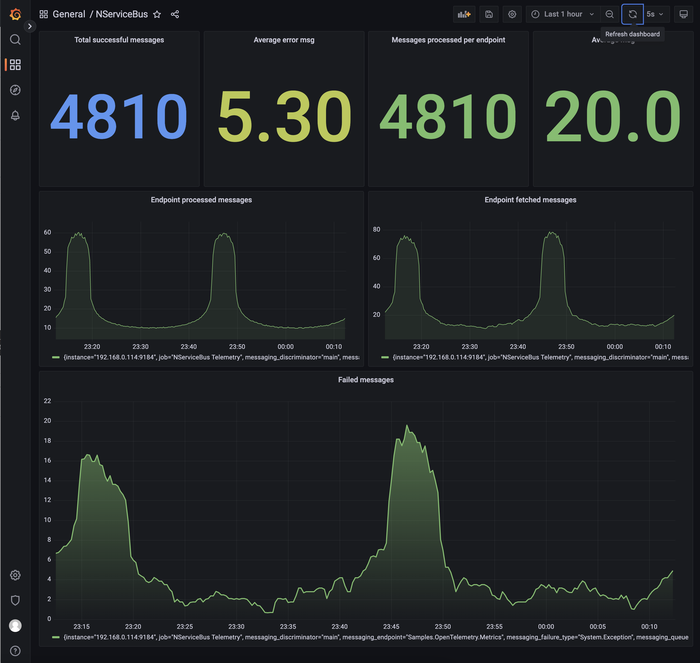

[Prometheus](https://prometheus.io) is a monitoring solution for storing time series data like metrics. [Grafana](https://grafana.com) visualizes the data stored in Prometheus (and other sources). This sample demonstrates how to capture NServiceBus OpenTelemetry metrics, store them in Prometheus, and visualize these metrics using a Grafana dashboard.



## Prerequisites

To run this sample, Prometheus and Grafana are required. This sample uses Docker and a `docker-compose.yml` file to run the stack.
To run the Docker stack, run `docker-compose up -d` in the directory where the `docker-compose.yml` file is located.

## Code overview

The sample simulates message load with a random 10% failure rate using the `LoadSimulator` class:

snippet: prometheus-load-simulator

## Reporting metric values

partial: enableotel

Opt into a specific metric, either by name or by wildcard:

snippet: enable-opentelemetry-metrics

Each reported metric is tagged with the following additional information:

- the queue name of the endpoint
- the uniquely addressable address for the endpoint (if set)
- the .NET fully qualified type information for the message being processed
- the exception type name (if applicable)

### Message processing counters

The following metric keys are available to monitor the rate of messages from the queuing system use:

- `nservicebus.messaging.fetches`
- `nservicebus.messaging.successes`
- `nservicebus.messaging.failures`

### Recoverability

To monitor [recoverability](/nservicebus/recoverability/) metrics, use:

- `nservicebus.recoverability.immediate`
- `nservicebus.recoverability.delayed`
- `nservicebus.recoverability.error`

#### Handler time, critical time, and processing time

To monitor [handler time, processing time, and critical time](/monitoring/metrics/definitions.md#metrics-captured) (in seconds) for successfully processed messages use:

- `nservicebus.messaging.handler_time`
- `nservicebus.messaging.processing_time`
- `nservicebus.messaging.critical_time`

## Exporting metrics

The metrics are gathered using OpenTelemetry standards on the endpoint and must be reported and collected by an external service. A Prometheus HTTP listener exposes this data so the Prometheus service, hosted as a docker service, can retrieve and store this information.

The listener is available via the `OpenTelemetry.Exporter.Prometheus.HttpListener"` NuGet package. In this sample, the service that exposes the data to scrape is hosted on `http://127.0.0.1:9464/metrics`:

snippet: enable-prometheus-http-listener

> [!NOTE]
> `127.0.0.1` is used so that the Prometheus service running in Docker can reach it over the network.

The raw metrics retrieved through the scraping endpoint look as follows:

```text
# HELP nservicebus_messaging_successes Total number of messages processed successfully by the endpoint.
# TYPE nservicebus_messaging_successes counter
nservicebus_messaging_successes{nservicebus_discriminator="main",nservicebus_message_type="SomeCommand, Endpoint, Version=1.0.0.0, Culture=neutral, PublicKeyToken=null",nservicebus_queue="OpenTelemetryDemo"} 850 1657693075515

# HELP nservicebus_messaging_fetches Total number of messages fetched from the queue by the endpoint.
# TYPE nservicebus_messaging_fetches counter
nservicebus_messaging_fetches{nservicebus_discriminator="main",nservicebus_message_type="SomeCommand, Endpoint, Version=1.0.0.0, Culture=neutral, PublicKeyToken=null",nservicebus_queue="OpenTelemetryDemo"} 1060 1657693075515

# HELP nservicebus_messaging_failures Total number of messages processed unsuccessfully by the endpoint.
# TYPE nservicebus_messaging_failures counter
nservicebus_messaging_failures{nservicebus_discriminator="main",nservicebus_failure_type="System.Exception",nservicebus_message_type="SomeCommand, Endpoint, Version=1.0.0.0, Culture=neutral, PublicKeyToken=null",nservicebus_queue="OpenTelemetryDemo"} 210 1657693075515
```

The diagram below shows the overall component interactions:



## Docker stack

In a production environment, the Prometheus service must be configured to retrieve the metrics data from the endpoint. Grafana must also be configured to get the data from Prometheus and visualize it as graphs. For this sample both services are setup as part of the [Docker stack](#prerequisites)

### Show a graph

Open Prometheus on `http://localhost:9000/graph`.

NServiceBus pushes events for *success, failure, and fetched*. These events must be converted to rates by a query. For example, the `nservicebus_messaging_successes_total` metric can be queried as:

```
avg(rate(nservicebus_messaging_successes_total[5m]))
```


## Grafana

Open Grafana on `http://localhost:3000`, which is made available as part of the [Docker stack](#prerequisites)

For a production environment, Grafana must be installed and configured to display the data scraped and stored in Prometheus. For more information on how to install Grafana, refer to the [Grafana installation guide](https://docs.grafana.org/installation).

### Dashboard

This sample includes an [export of the Grafana dashboard](grafana-endpoints-dashboard.json) which can be [imported](https://docs.grafana.org/reference/export_import/) as a reference.

To create a custom dashboard using Prometheus data, the following steps must be performed:

- Add a new dashboard
- Add a graph
- Click its title to edit
- From the Data source dropdown, select Prometheus
- For the query, open the Metrics dropdown and select one of the metrics. Built-in functions (e.g. rate) can also be applied.


