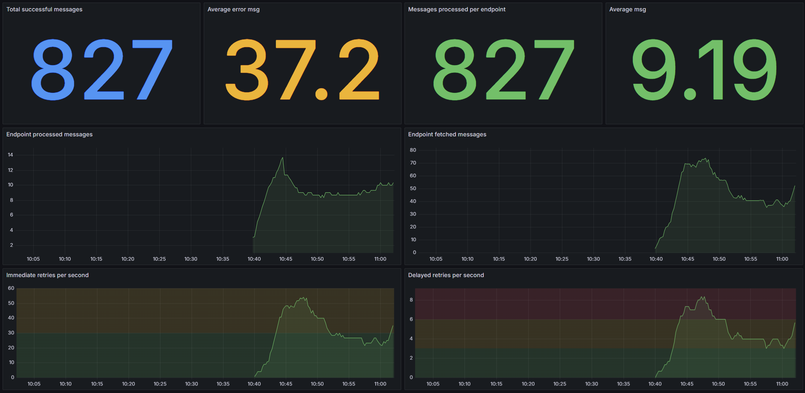

## Introduction

[Prometheus](https://prometheus.io) is a monitoring solution for storing time series data like metrics. [Grafana](https://grafana.com) allows to visualize the data stored in Prometheus (and other sources). This sample demonstrates how to capture NServiceBus OpenTelemetry metrics, store them in Prometheus and visualize these metrics using a Grafana dashboard.


## Prerequisites

To run this sample, Prometheus and Grafana are required. This sample uses docker and an accompanied `docker-compose.yml` file to run the stack.

## Code overview

The sample simulates messages load with a random 10% failure rate using the `LoadSimulator` class:

snippet: prometheus-load-simulator

## Reporting metric values

NServiceBus uses the OpenTelemetry standard to report metrics. The metrics are disabled by default, and can be enabled by opting into a specific metric, either by name or by wildcard: 

snippet: enable-opentelemetry-metrics

There are three metrics reported as a Counter, with the following keys:

 * Number of fetched messages via `nservicebus.messaging.fetches`
 * Number of failed messages via `nservicebus.messaging.failures`
 * Number of successfully processed messages via `nservicebus.messaging.successes`

Each reported metric is tagged with the following additional information:

 * the queue name of the endpoint
 * the uniquely addressable address for the endpoint (if set)
 * the .NET fully-qualified type information for the message being processed
 * the exception type name (if applicable)

## Exporting metrics

The metrics are gathered using OpenTelemetry standard on the endpoint and need to be reported and collected by an external service. A Prometheus exporter can expose this data via an HTTP endpoint and the Prometheus service, hosted as a docker service, can retireve and store these information. This exporter is available via a NuGet package `OpenTelemetry.Exporter.Prometheus`. In this sample the service that exposes the data to scrape is hosted on `http://localhost:9185/metrics`. To enable the Prometheus exporter, the following should be executed:

snippet: enable-prometheus-exporter

Note: the HTTP endpoint is also exposed through a local IP address so the Prometheus service running in docker can reach it over the network.

The raw metrics retrieved through the scraping endpoint would look like this:

```text
# HELP nservicebus_messaging_successes Total number of messages processed successfully by the endpoint.
# TYPE nservicebus_messaging_successes counter
nservicebus_messaging_successes{nservicebus_discriminator="main",nservicebus_message_type="SomeCommand, Endpoint, Version=1.0.0.0, Culture=neutral, PublicKeyToken=null",nservicebus_queue="OpenTelemetryDemo"} 850 1657693075515

# HELP nservicebus_messaging_fetches Total number of messages fetched from the queue by the endpoint.
# TYPE nservicebus_messaging_fetches counter
nservicebus_messaging_fetches{nservicebus_discriminator="main",nservicebus_message_type="SomeCommand, Endpoint, Version=1.0.0.0, Culture=neutral, PublicKeyToken=null",nservicebus_queue="OpenTelemetryDemo"} 1060 1657693075515

# HELP nservicebus_messaging_failures Total number of messages processed unsuccessfully by the endpoint.
# TYPE nservicebus_messaging_failures counter
nservicebus_messaging_failures{nservicebus_discriminator="main",nservicebus_failure_type="System.Exception",nservicebus_message_type="SomeCommand, Endpoint, Version=1.0.0.0, Culture=neutral, PublicKeyToken=null",nservicebus_queue="OpenTelemetryDemo"} 210 1657693075515
```

Below diagram shows the overall component interactions:


## Docker stack

Prometheus service needs to be configured to get the metrics data from the endpoint. Grafana also needs to be configured to get the data from Promethus and visualize it as graphs.

To run the docker stack, run `docker-compse up -d` in the directory where the `docker-compose.yml` file is located.

### Configuring Prometheus

Copy the following files into the mapped volumes of the Prometheus and Grafana.

 * `prometheus_ds.yml` should be copied to `./grafana/provisioning/datasources` folder
 * `prometheus.yml` should be copied to `./prometheus` folder

Open `prometheus.yml` and update the target IP address. This should be the address of the machine running the sample and the port the Promethus exporter is configured to run. Docker stack should be able to reach this IP and port. 

```yml
  - targets:
    - '192.168.0.10:9184'
```

### Show a graph

Start Prometheus by running the docker stack. NServiceBus pushes events for *success, failure, and fetched*. These events need to be converted to rates by a query, for example the `nservicebus_messaging_successes` metric can be queried as:

```
avg(rate(nservicebus_messaging_successes[5m]))
```


## Grafana

Grafana needs to be installed and configured to display the data scraped and stored in Prometheus. For more information how to install Grafana refer to the [Installation Guide](https://docs.grafana.org/installation). In this sample, the Grafana service runs as part of the docker stack mentioned above.

#### Dashboard

To graph the metrics, the following steps have to be performed:

 * Add a new dashboard
 * Add a graph
 * Click its title to edit
 * From the Data source dropdown select Prometheus
 * For the query open the Metrics dropdown and select one of the metrics. Built-in functions (e.g. rate) can also be applied.



The sample includes an [export of the grafana dashboard](grafana-endpoints-dashboard.json) which can be [imported](https://docs.grafana.org/reference/export_import/) as a reference.
