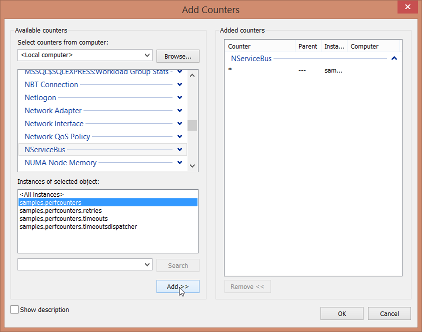
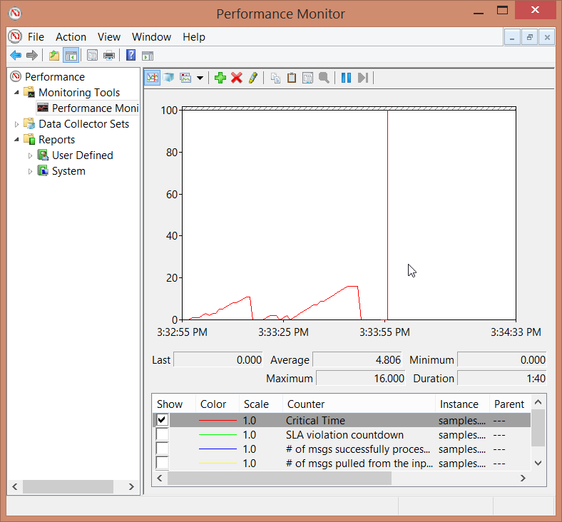
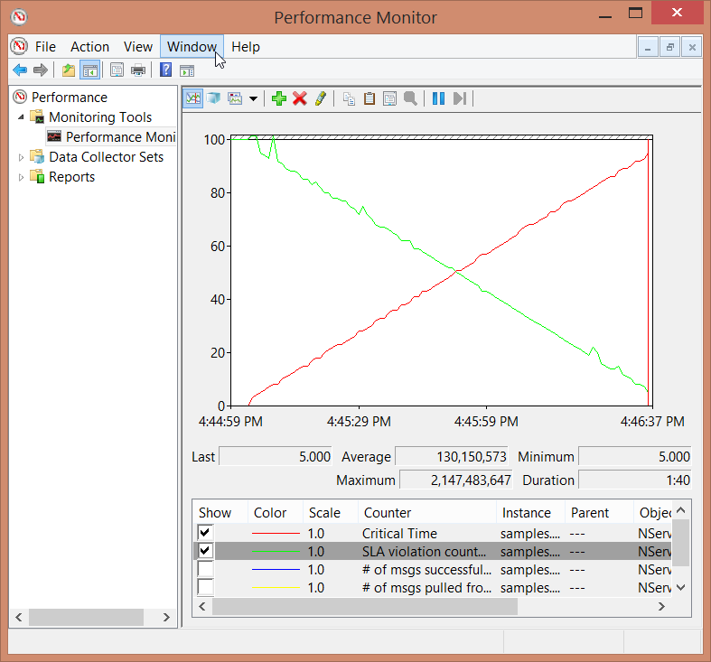
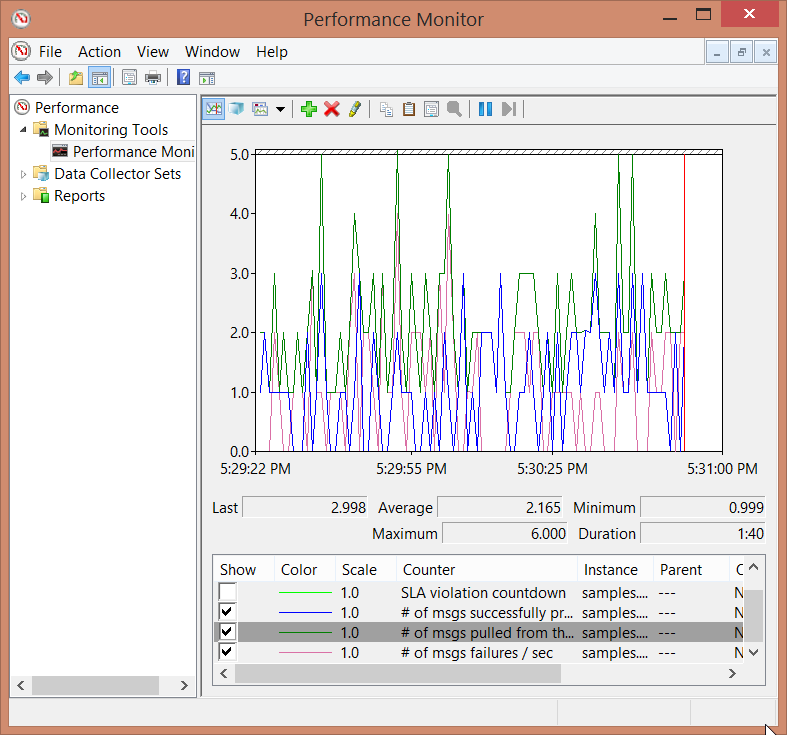

## Install Counters

Refer to [Performance Counters](/monitoring/metrics/performance-counters.md) to see how the performance counters should be installed.

## Enabling Counters For The Endpoint

Both the `SLA` and `Critical Time` counters are enabled and configured in code.

snippet: enable-counters

The other counters are enabled by default.

NOTE: Regardless of whether the SLA and Critical Time counters are enabled, all endpoints must be restarted after installing the counters to start collecting the counter data.


## The Handler

The handler has a random delay in achieving some fake load. The maximum random number is greater than the above-configured SLA value to cause SLA violations occasionally.

snippet: handler

## Run Solution

Run the solution so that the Performance Counter instances are registered.

## Add Counters in Performance Monitor

 1. Start [Windows Performance Monitor](https://technet.microsoft.com/en-au/library/cc749249.aspx).
 1. Clear the default counters.
 1. Add the NServiceBus Counters



## Send Messages

Send any number of messages and watch the effect on the specific Performance Counters.

The sending code in `Program.cs` is set to send ten messages at a time.

## Performance Counters Analysis

### Critical Time

Continually sending more messages will cause the load on the endpoint to increase. This will eventually result in a back-logged queue. Messages will spend longer in the queue resulting in a gradual increase in `Critical Time`. Stop sending messages, and eventually, the endpoint will catch up, causing the `Critical Time` dropping back to zero.




### SLA Violation Countdown

The `SLA Violation Countdown` is the number of seconds left until the SLA for the particular endpoint is breached, so effectively, this is an inverse counter. When messages are sent continually, the `Critical Time` will increase while the `SLA Violation Countdown` will decrease.




### Other counters

The following counters are only available in Version 4 and above.

To visualize both success and failures in the same view, change the handler code to the following.

```cs
int sleepTime = random.Next(1, 1000);
Thread.Sleep(sleepTime);
if (sleepTime%2 != 0)
{
    throw new Exception();
}
log.Info($"Hello from MyHandler. Slept for {sleepTime}ms");
```

Run the endpoint and send some messages and monitor the results of all the performance counters.


