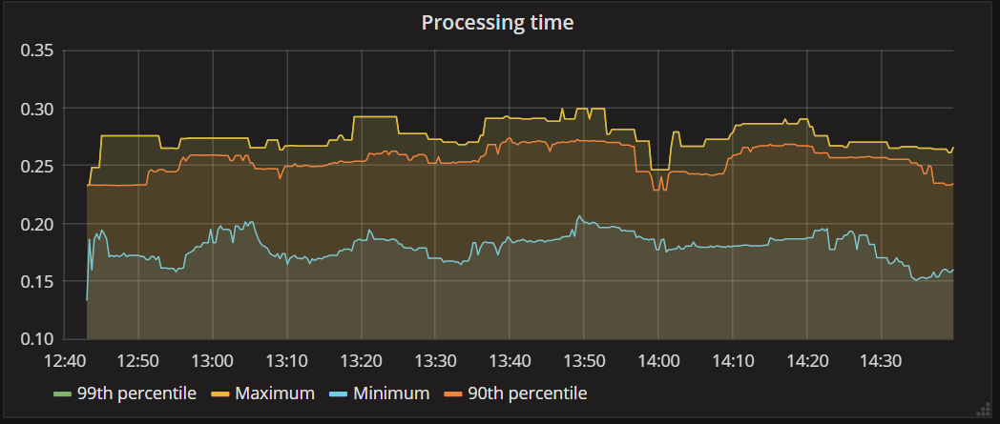
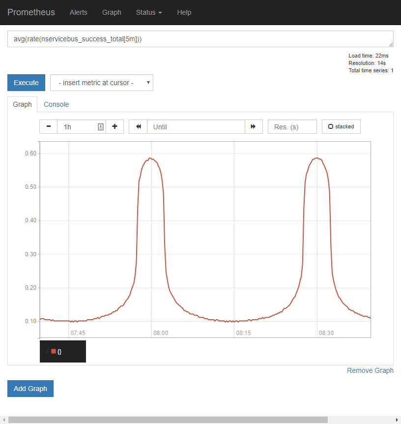
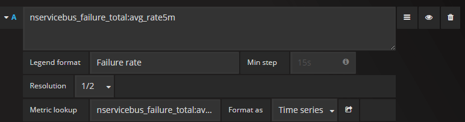
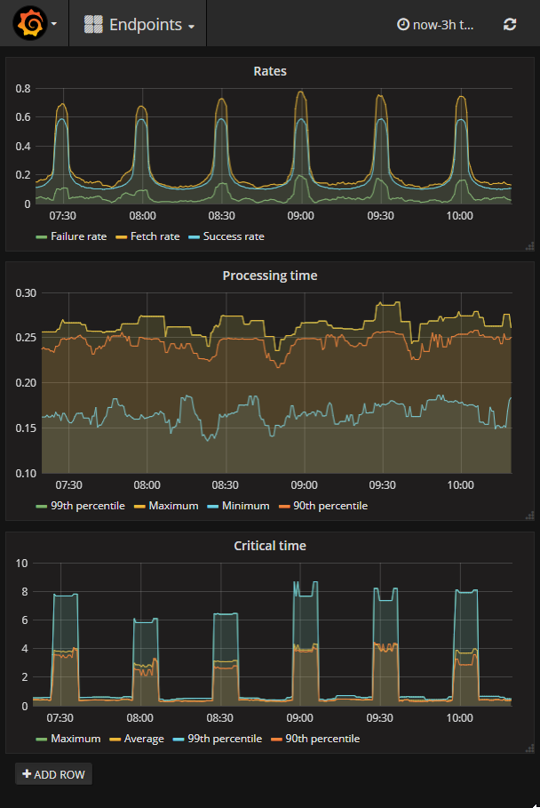

[Prometheus](https://prometheus.io) is a monitoring solution for storing time series data like metrics. [Grafana](https://grafana.com) allows you to query and visualize the data stored in Prometheus (and other sources). This sample demonstrates how to capture NServiceBus metrics, storing these in Prometheus and visualizing this using Grafana.





This sample reports the following metrics to Prometheus:

 * Fetched messages per second 
 * Failed messages per second
 * Successful messages per second
 * Critical time 
 * Processing time


 The sample also shows data like `Average message processing time in milliseconds` and `Maximum critical time in milliseconds`. For a detailed explanation of these metrics refer to the [metrics captured section in the metrics documentation](/nservicebus/operations/metrics.md#metrics-captured).


## Prerequisites

To run this sample, download and run both Prometheus and Grafana. This sample uses Prometheus 1.7.1 and Grafana 4.4.2 that both run on Windows.

- https://prometheus.io
- https://grafana.com


## Code overview

The sample simulates messages load with a random 10% failure rate using the `LoadSimulator` class:

snippet: load-simulator


## Capturing metric values

We need the following package:

- NServiceBus.Metrics
- prometheus-net


We host a Promethues service via the nuget package `prometheus-net` and register custom observers for the metric probes provided via `NServiceBus.Metrics`. This all setup in  `PrometheusFeature`


snippet: enable-nsb-metrics


The names provided by the `NServiceBus.Metrics` probes are not compatible with Prometheus. We need to map these to names that are aligned with the [naming conventions defined by Prometheus](https://prometheus.io/docs/practices/naming/)

Counters : `nservicebus_{counter-name}_total`

Summaries: `nservicebus_{summary-name}_seconds`


snippet: name-mapping


Registering the observers basically is converting NServiceBus.Metric *Signals* to Prometheus *Counters* and NServiceBus.Metric *Durations* to Prometheus *Summaries*.  We also want to add a label to identify the endpoint within Prometheus. With this label we are capable of filtering and grouping metric values 


During the registration we need to:

- Map metric names
- Register observer callbacks
- Create summaries and counters 
- Invoke the summaries and counters in the observer callback


snippet: register-probe


## Prometheus

Prometheus needs to be configured to pull data from the endpoint. They provide a pretty good [getting started guide](https://prometheus.io/docs/introduction/getting_started/). 


### Add a target

 Edit `prometheus.yml` and  add a new target for scraping similar

```
- job_name: 'nservicebus'

    scrape_interval: 5s

    static_configs:
      - targets: ['localhost:3030']
```

### Show a graph

NServiceBus pushes events for *success, failure, and fetched*. These events need to be converted to rates by a query:

    avg(rate(nservicebus_success_total[5m])) 



### Use rules


The mentioned query is an expensive operation on the database and can be precalculated by configuring rules that calculate rates based on the counters. 

    nservicebus_success_total:avg_rate5m = avg(rate(nservicebus_success_total[5m]))
    nservicebus_failure_total:avg_rate5m = avg(rate(nservicebus_failure_total[5m]))
    nservicebus_fetched_total:avg_rate5m = avg(rate(nservicebus_fetched_total[5m]))


Instead of the query mentioned earlier we can now use the pre calculated query.

    nservicebus_success_total:avg_rate5m
### Example configuration

Prometheus configuration files demonstrating the concepts from this sample:

- [nservicebus.rules](nservicebus.rules)
- [prometheus.yml](prometheus.yml)


## Grafana

Prometheus needs to be added as a *Datasource* within Grafana. After that you will be capable use this datasource for your graph queries.


### Graph Metric


To graph the Prometheus rule  `nservicebus_failure_total:avg_rate5m` we have to perform the following steps:

- Add a new dashboard 
- Add a graph
- Click its title to edit
- Click the Metric tab




### Dashboard




The sample included an [export of the grafana dashboard](grafana-endpoints-dashboard.json), this can be imported as a reference.

### 