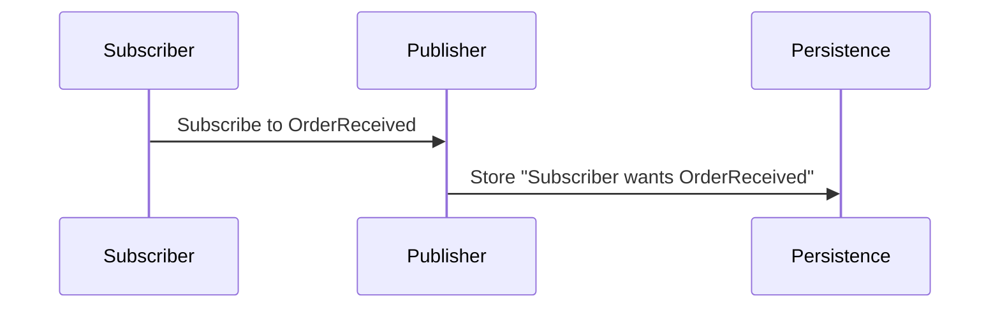
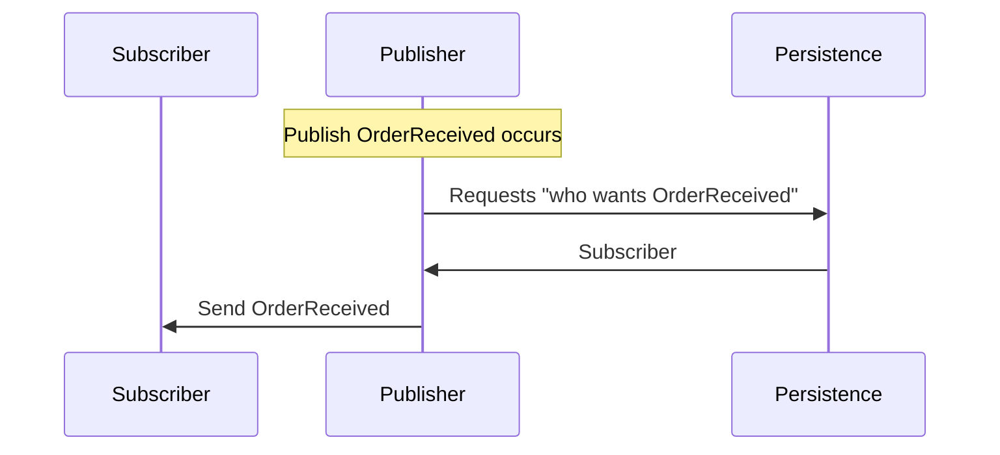

The Publish/Subscribe pattern allows greater flexibility in developing distributed systems by decoupling system components from each other. Once the system is capable of publishing an event, additional capabilities can be added to the system by adding a new event subscriber. A new subscriber can be added in a separate physical process, without changing or redeploying the code that publishes the message.

This sample shows how to publish an event message from a messaging endpoint in one physical process, subscribe to the event in a separate messaging endpoint in a second physical process, and execute a message handler when an event message is received.

downloadbutton

Before running the sample, look over the solution structure, the projects, and the classes. The projects `Publisher`,and `Subscriber` are console applications that each host an instance of an NServiceBus messaging endpoint.

## Defining messages

The `Shared` project contains the definition of the messages that are sent between the processes. Open "OrderReceived.cs" to see the message that will be published by this sample. Note that this event implements a marker interface called `IEvent` to denote that this message is an event. To define messages without adding a dependency to NServiceBus, use [Unobtrusive Mode Messages](/nservicebus/messaging/unobtrusive-mode.md). 

## Creating and publishing messages

As the name implies, the `Publisher` project is a publisher of event messages. It uses the NServiceBus API to publish the `OrderReceived` event every time the `1` key is pressed. The created message is populated and [published](/nservicebus/messaging/publish-subscribe/) using the `Publish` API.

snippet: PublishLoop

## Implementing subscribers

To receive messages from the publisher, the subscribers [must subscribe to the message types](/nservicebus/messaging/publish-subscribe/) they are designed to handle. A subscriber must have a handler for the type of message and a [configuration](/nservicebus/messaging/publish-subscribe/) that tells the endpoint where to send subscriptions for messages:

 * The `Subscriber` process handles and subscribes to the `OrderReceived` type.
 * The handlers in each project are in files that end in with the word `Handler` for example `OrderReceivedHandler.cs`. 
 * `Subscriber` process uses the default auto-subscription feature of the bus where the the bus automatically sends subscription messages to the configured publisher. [The auto-subscribe feature can be explicitly disabled](/nservicebus/messaging/publish-subscribe/controlling-what-is-subscribed.md) as part of the endpoint configuration.
  

## Run the sample

When running the sample, notice the three open console applications and many log messages on each. Almost none of these logs represent messages sent between the processes.

Bring the `Publisher` process to the foreground.

Click the `1` key repeatedly in the `Publisher` process console window, and see how the messages appear in the `Subscriber` console window. 

## Message Flow

Note: The below [persistence-based publish-subscribe](/nservicebus/messaging/publish-subscribe/#mechanics-persistence-based-message-driven) is the behavior for [unicast transports](/transports/#types-of-transports-unicast-only-transports).  [Broker transports](/transports/#types-of-transports-broker-transports) have [native publish-subscribe](/nservicebus/messaging/publish-subscribe/#mechanics-native) features.
  

### Subscribe

`Subscriber` sends a subscription message to `Publisher` which is stored in the [persistence](/persistence/) of `Publisher`. 

### Publish

When a publish occur on `Publisher` it queries the persistence for subscribers.

## Fault-tolerant messaging

Shut down `Subscriber` by closing its console window. Return to the `Publisher` process and publish a few more messages by pressing the `1` key several more times. Notice how the publishing process does not change and there are no errors even though the subscriber process is no longer running.

In Visual Studio, right click the project of the closed subscriber, and restart it by right clicking the `Subscriber` project and selecting `Debug` and then `Start new instance`.

partial: faulttolerance
