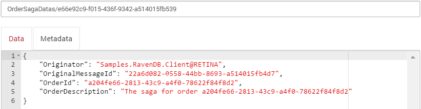
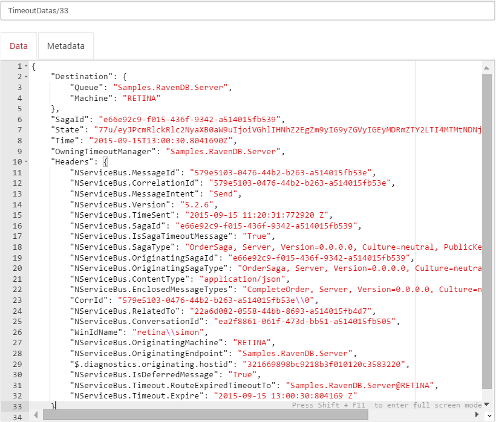
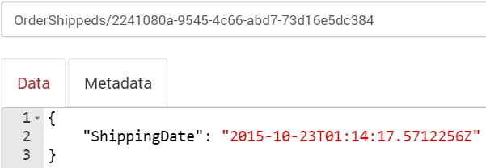

include: dtc-warning

include: cluster-configuration-warning

## Code walk-through

This sample shows a simple Client + Server scenario.

 1. `Client` sends a `StartOrder` message to `Server`.
 2. `Server` starts an `OrderSaga`.
 3. `OrderSaga` requests a timeout with a `CompleteOrder` data.
 4. When the `CompleteOrder` timeout fires the `OrderSaga` publishes a `OrderCompleted` event.
 5. The Server then publishes a message that the client subscribes to.
 6. `Client` handles `OrderCompleted` event.

### Raven Config

partial: config-description

snippet: config

include: raven-dispose-warning

### Order Saga Data

snippet: sagadata

### Order Saga

snippet: thesaga

### Handler Using Raven Session

The handler access the same Raven `ISession` via `ISessionProvider`.

snippet: handler

## The Data in RavenDB

The data in RavenDB is stored in three different collections.

WARNING: By default, this sample uses the [Learning Transport](/transports/learning/), which has built-in support for timeouts and subscriptions. To see the data for timeouts and subscriptions, it's necessary to change the sample to a different transport that does not have these native features such as [MSMQ](/transports/msmq/).

### The Saga Data

 * `IContainSagaData.Id` maps to the native RavenDB document `Id`.
 * `IContainSagaData.Originator` and `IContainSagaData.OriginalMessageId` map to simple properties.
 * Custom properties on the SagaData, in this case `OrderDescription` and `OrderId`, are also mapped to simple properties.

### The Timeouts

 * The subscriber is stored in a `Destination` with the nested properties `Queue` and `Machine`.
 * The endpoint that initiated the timeout is stored in the `OwningTimeoutManager` property.
 * The connected saga ID is stored in a `SagaId` property.
 * The serialized data for the message is stored in a `State` property.
 * The scheduled timestamp for the timeout is stored in a `Time` property.
 * Any headers associated with the timeout are stored in an array of key value pairs.

### The Subscriptions

Note that the message type maps to multiple subscriber endpoints.

 * The Subscription message type and version are stored in the `MessageType` property.
 * The list of subscribers is stored in a array of objects each containing `Queue` and `MachineName` properties.

### The Handler Stored data

