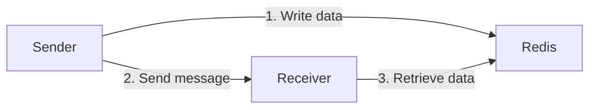

This sample shows how to pass large data between endpoints using [Redis](https://redis.io/).

include: redis-feedback

## Prerequisites

This sample connects to a local Redis instance. See the [Redis guidance for installing a new instance](https://redis.io/docs/latest/get-started/).

Alternatively with Docker installed locally, execute the following command in the solution directory:

```bash
docker compose up -d
```

## Overview



1. The Sender endpoint generates data and stores it in the Redis instance
1. The Sender endpoint sends a message with the Redis key to the Receiver endpoint
1. The Receiver endpoint retreives the data from the Redis instance using the key in the message

## Running the project

1. Run a Redis instance.
1. Run the Sender endpoint to generate data and send a message to the Receiver endpoint.
1. Run the Receiver endpoint to process the message.

## Code walkthrough

Both endpoints use a shared extension method to connect to the Redis instance at startup and make the Redis database instance available in the application container.

snippet: use-redis

When the Sender endpoint starts a random string is generated and stored in the Redis instance.

snippet: set-string

Once the data has been stored, a message is sent to process it. Note that this message does not contain the data, only the Redis key.

snippet: send-message

When the Receiver endpoint processes the message, the data is retrieved using the key provided. Some processing occurs (in this case finding the most common letter) and the result is logged.

snippet: get-string

After processing the message, the message handler sets the Redis key to expire after 30 minutes.

snippet: expire-key

> [!CAUTION]
> The message handler _could_ delete the Redis key directly instead of setting an expiry on it. This is dangerous as the Redis client does not participate in the NServiceBus transaction. If the transaction rolls back and the message must be retried, it is important that the Redis key has not been deleted. It is safer to set a timeout which is at least long enough to allow for any immediate and delayed retries.

include: redis-feedback
