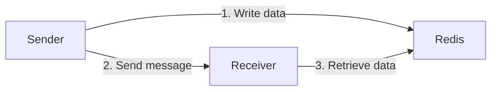

This sample shows how to pass large data between endpoints using [Redis](https://redis.io/).

include: redis-feedback

## Prerequisites

This sample connects to a local Redis instance. See the [Redis guidance for installing a new instance](https://redis.io/docs/latest/get-started/).

Alternatively with Docker installed locally, execute the following command in the solution directory:

```bash
docker compose up -d
```

## Overview



1. The Sender endpoint generates data and stores it in the Redis instance
1. The Sender endpoint sends a message with the Redis key to the Receiver endpoint
1. The Receiver endpoint retrieves the data from the Redis instance using the key in the message

## Running the project

1. Run a Redis instance.
1. Run the Sender endpoint to generate data and send a message to the Receiver endpoint.
1. Run the Receiver endpoint to process the message.

## Code walkthrough

The solution contains a claim check implementation that writes to and reads from Redis.

snippet: claim-check

Each endpoint is configured to use the Redis claim check. The conventions are updated to tell NServiceBus which properties should have the claim check applied.

snippet: configure-claim-check

When the Sender endpoint starts, a random string is generated and assigned to a property on the message. NServiceBus transparently places the data in Redis and sends the message without this large property.

snippet: send-message

On the receiving side, NServiceBus restores the data from Redis before the message handler is called.

snippet: process-message
