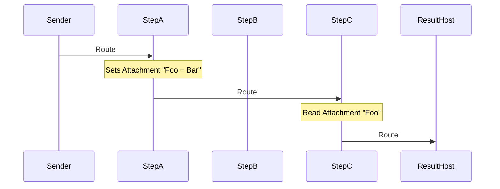
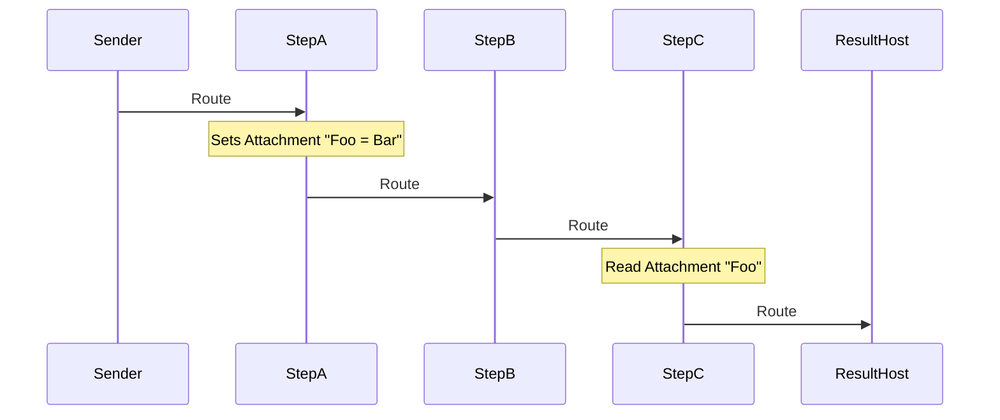

## Introduction

Uses the [Routing Slip pattern](https://www.enterpriseintegrationpatterns.com/patterns/messaging/RoutingTable.html) feature of the [MessageRouting](https://github.com/jbogard/NServiceBus.MessageRouting) project.

## Code walk-through

The solution consists of 6 Projects

 * Messages: The shared message definitions.
 * Sender: Initiates the message sends.
 * StepA, StepB, StepC: The handling endpoints to to show how the message flows between endpoints.
 * ResultHost: The final destination endpoint for messages that logs all the endpoints the message was routed through.

### Enabling Routing Slips Feature

All endpoints have routing slips enabled:

snippet: enableRoutingSlips

## Multiple message interpretations 

Each step in the routing has its own definition of the message. For example StepA considers the message contract to be.

snippet: single-message

Both the Sender and the ResultHost have the full message context by referencing the Messages project.

snippet: multi-message

On Send all share properties are set. 

snippet: multi-message-send

But in each step project they are only aware of the specific their specific message interpretations:

snippet: step-handler

### Message sending 

The Sender project alternates between two send actions:

snippet: alternate

#### Route to A, C and ResultHost

snippet: SendAC

#### Route to A, B, C and ResultHost

snippet: SendABC

## Runtime Behavior

### When routing to A, C and ResultHost

 1.  StepA receives message
 1.  StepC receives message
 1.  ResultHost receives message

### When routing to A, B, C and ResultHost

 1.  StepA receives message
 1.  StepB receives message
 1.  StepC receives message
 1.  ResultHost receives message

## Attachments

Note that StepA sets a routing slip attachment:

snippet: set-attachments

Which is then retrieved by StepC

snippet: read-attachment
