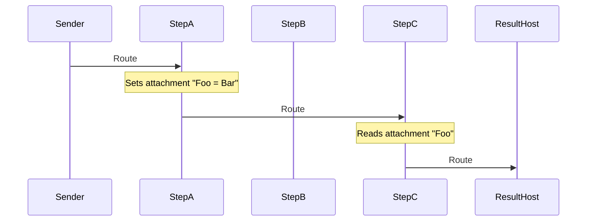
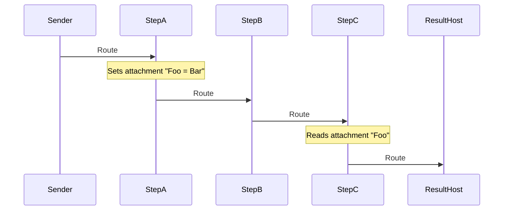

## Introduction

This sample demonstrates the use of the [Routing Slip pattern](https://www.enterpriseintegrationpatterns.com/patterns/messaging/RoutingTable.html) with the [MessageRouting](https://github.com/jbogard/NServiceBus.MessageRouting) project.

A **routing slip** allows a message to carry a list of destinations it should pass through. Each endpoint processes the message and then forwards it to the next stop on the slip. This enables dynamic workflows without hardcoding routes between endpoints.

---

## Solution Overview

The solution consists of six projects:

- **Messages** – Shared message definitions.
- **Sender** – Initiates the message send and defines the route.
- **StepA, StepB, StepC** – Processing endpoints that demonstrate how a message flows between steps.
- **ResultHost** – The final destination that logs all endpoints the message passed through.

---

## Enabling Routing Slips

All endpoints have the routing slip feature enabled:

```text
snippet: enableRoutingSlips
```

---

## Multiple Message Interpretations

Each step in the route defines its own interpretation of the message.  

For example, StepA treats the message contract as follows:

```text
snippet: single-message
```

Both the Sender and ResultHost projects use the full message context by referencing the **Messages** project:

```text
snippet: multi-message
```

When sending, all shared properties are set:

```text
snippet: multi-message-send
```

However, in each step project, handlers only work with their own specific interpretation of the message:

```text
snippet: step-handler
```

---

## Message Sending

The **Sender** project alternates between two send actions:

```text
snippet: alternate
```

### Route to A, C, and ResultHost

```text
snippet: SendAC
```

### Route to A, B, C, and ResultHost

```text
snippet: SendABC
```

---

## Runtime Behavior

### When routing to A, C, and ResultHost

1. StepA receives the message  
2. StepC receives the message  
3. ResultHost receives the message  



---

### When routing to A, B, C, and ResultHost

1. StepA receives the message  
2. StepB receives the message  
3. StepC receives the message  
4. ResultHost receives the message  



---

## Attachments

StepA sets a routing slip attachment:

```text
snippet: set-attachments
```

StepC then retrieves the attachment:

```text
snippet: read-attachment
```
