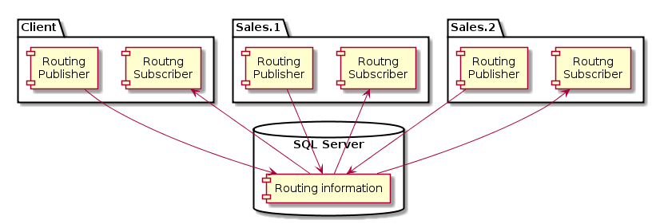

The sample demonstrates how the routing model can be extended to allow for configuration-free routing with [MSMQ transport](/transports/msmq/). It does so by making endpoint instances publish metadata information about themselves:

 * identity - logical name and physical address;
 * handled messages;
 * published events.

The advantage of configuration-free approach is low development friction and simpler maintenance. 

## Prerequisites

include: sql-prereq

The database created by this sample is `NsbSamplesAutomaticRouting`.

## Running the project

 1. Start all the projects by hitting F5.
 1. The text `Press <enter> to send a message` should be displayed in the Client's console window.
 1. Wait until all the endpoints exchange their routing information. Notice each endpoint logs the routing info as it discovers other endpoints.
 1. Hit enter several times to send some messages.

### Verifying that the sample works correctly

 1. The Sales.1 and Sales.2 consoles display information about accepted orders in round-robin fashion.
 1. The Shipping endpoint displays information that orders were shipped.
 1. The Billing endpoint displays information that orders were billed.

## Code walk-through

This sample contains four applications that use configuration-free custom routing:

snippet: EnableAutomaticRouting

NOTE: In order to use this custom routing all message types published using `context.Publish()` need to be specified. The inherited event messages types will be added automatically.

### Client

The Client application submits the orders for processing by the back-end systems by sending a `PlaceOrder` command.

### Sales

The Sales application accepts clients' orders and publishes the `OrderAccepted` event.

NOTE: In real-world scenarios NServiceBus endpoints are scaled out by deploying multiple physical instances of a single logical endpoint to multiple machines. For simplicity, in this sample the scale out is simulated by having two separate projects, Sales and Sales2.

### Shipping and Billing

Shipping and Billing applications subscribe to `OrderAccepted` event in order to execute their business logic.

### Shared project

The shared project contains definitions for messages and the custom routing logic.

### Custom automatic routing

The automatic routing is based on the idea of endpoints exchanging information about types of messages they handle and types of messages they publish. In this sample they share the information using a table in SQL Server database. Each endpoint instance owns one row. However, other solutions can be used (e.g. using tool like [Consul](https://www.consul.io/)).

All the routing components are wired up using the following code:

snippet: Feature

It creates a publisher and a subscriber for the routing information, as well as the communication object they use to exchange information between endpoints instances. It also registers an additional behavior that ensures that all published types are properly advertised. The automatic routing discovery protocol has no master and works in a peer-to-peer manner, therefore both publisher and subscriber need to be active in each endpoint instance.

<!--
http://www.planttext.com/planttext
@startuml

package "Client" {
    Component [Routing\nSubscriber] as C_S
    Component [Routing\nPublisher] as C_P
}

package "Sales.1" {
    Component [Routing\nSubscriber] as S1_S
    Component [Routing\nPublisher] as S1_P
}

package "Sales.2" {
    Component [Routing\nSubscriber] as S2_S
    Component [Routing\nPublisher] as S2_P
}

database "SQL Server\n" {
    [Routing information] as RI
}

C_P -down-> RI
RI -up-> C_S

S1_P -down-> RI
RI -up-> S1_S

S2_P -down-> RI
RI -up-> S2_S

@enduml
-->

The following information is required by this automatic routing implementation:

 * Mapping command types to their logical destinations.
 * Mapping event types to their respective logical publishers.
 * Mapping logical endpoints to their physical instances.

`Logical` endpoints, publishers and destinations are `Endpoints`, while `physical` instances are `Endpoint Instances`. Refer to [Endpoints](/nservicebus/endpoints/) article for full definitions.

This information is updated every time the automatic routing feature detects a change in the logical topology:

snippet: AddOrReplace
