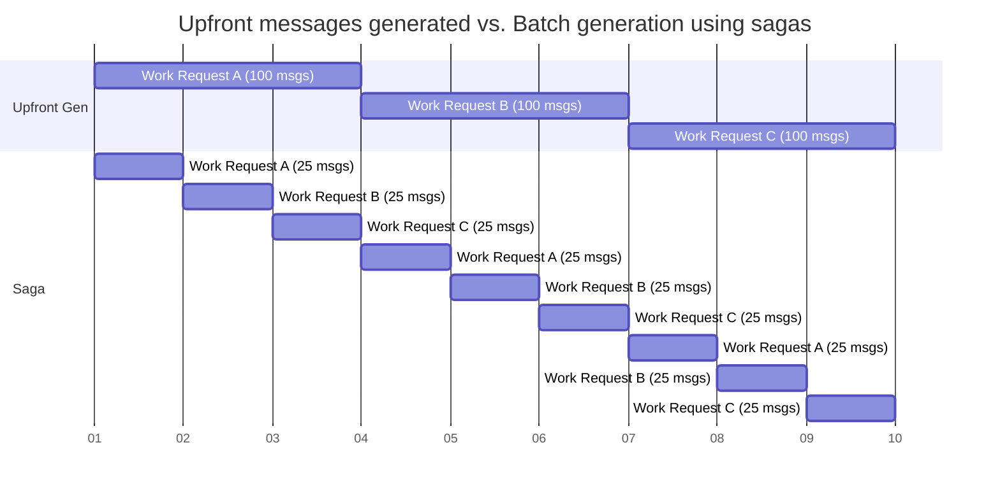

## Introduction

This sample shows how to control task generation via batching of the work items through Sagas. This pattern of throttled message generation can be helpful when the the rate of generation needs to be controlled. For example:

- when many messages are generated as part of an incoming message. In this case, the number of messages can further delay other messages in the same queue.
- when the work as a whole is completed only when all messages are processed. If all messages are generated upfront and the work is considered 'cancelled' or 'failed', generated messages that are already in the queue would still have to be processed (e.g. no-op).

To avoid congestion in the queue, messages can be generated and routed to a [specific endpoint](/nservicebus/messaging/routing.md#make-instance-uniquely-addressable) (endpoint per work type), or [the concurrency limit can be set to 1](/nservicebus/operations/tuning.md#configuring-concurrency-limit) to have the messages processed sequentially. The [routing slip pattern](/samples/routing-slips/) is also a good alternative in processing sequential messages.

The messages generated upfront could cause delays on processing of the message that get in the queue, whereas with batching, saga processing can be interleaved and multiple batches can be processed in parallel.



Once the projects are started, press <kbd>S</kbd> to send a `StartProcessing` message with a randomly-generated `WorkCount` number that starts a new saga instance. This is a result of a configuration specified with the `IAmStartedByMessages` interface and mapping that [correlates](/nservicebus/sagas/message-correlation.md) the `StartProcessing.ProcessId` property on the message with the `OrderSagaData.ProcessId` property on the saga data.

When processing the `StartProcessing` message, each saga instance creates a `ProcessWorkOrder` instance in batches of 100 messages and sends them off to the `WorkProcessor` endpoint to handle. Once all the messages of a batch are completed, the next batch of messages are generated.

The output to the console of the `WorkGenerator` will be:

```
Started.
Press 'S' to start a new process or [Enter] to exit.
SStarted process 'cc39af80-d33c-45e0-9991-5ece40cf7d6b' with '473' work orders.
Processing saga started: 'cc39af80-d33c-45e0-9991-5ece40cf7d6b'
Starting the process for '473' work orders.
Queueing next batch of work orders: (1 - 100).
Queueing next batch of work orders: (101 - 200).
Queueing next batch of work orders: (201 - 300).
Queueing next batch of work orders: (301 - 400).
Queueing next batch of work orders: (401 - 473).
All done. Took 33.737792
```

The output to the console of the `WorkProcessor` will be:

```
Started.
Press [Enter] to exit.
Processing work order '1'
Processing work order '4'
Processing work order '10'
Processing work order '2'
...
Processing work order '431'
Processing work order '427'
Processing work order '441'
Processing work order '420'
```

Notice that while the work requests are generated in sequence, on the processing side the work can happen out of order. The total time taken the process to finish is also logged.

> [!NOTE]
> Metrics such as Critical Time may not be sufficient to monitor how long the end-to-end process takes. This is something to note and measure to ensure quality of service.

## The saga

The saga controls the generation of the next batch of work and monitors for the completion signal of all messages in that batch, before starting the next batch. Very long-running work items or failed work items could unintentionally stall the subsequent work items. Consider using saga timeouts and or work item failure responses to mitigate this if required.

snippet: saga-import-nextbatch

When a `WorkOrderCompleted` message comes back from the work-handling endpoint, the saga checks if all the work completed or if there is still another batch to generate.

snippet: saga-work-completed
