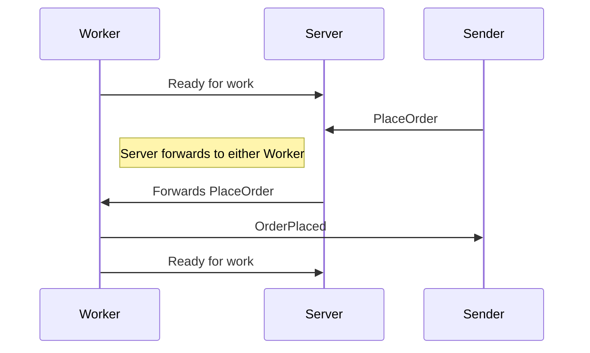

Sometimes a single endpoint for handling messages is not enough so there is a need to scale out. This sample demonstrates how easy it is to use NServiceBus to scale out existing message processing by adding more workers on different machines.

NOTE: The distributor feature expects that workers will be deployed to multiple machines. In this sample, all workers are on a single machine in order to keep it simple, however such an approach should not be applied in a production environment. See [Scaling out in a real environment](#scaling-out-in-a-real-environment) section for more information.
 

## Code walk-through

There are several projects in the solution.


### Sender

A simple project that sends a message to `Server` and handles the message back from the `Worker`.


#### Sending code

snippet: sender


#### Handling code


snippet: sender-event-handler


### Shared

Common message definitions shared between all projects.


### Worker.Handlers

A library for sharing handlers between workers. The project contains a single handler.

snippet: WorkerHandler

WARNING: If publishing from a handler inside a worker then all workers mush share the same [subscription persistence](/persistence/).


### Server

A host for the distributor

snippet: server


### Worker1 and Worker2

The workers are hosts for running the handlers defined in `Worker.Handlers`


#### Startup code

snippet: Workerstartup


#### Configuration

snippet: workerConfig

The Node in the `MasterNodeConfig` points to the host name where the MasterNode is running. If running the Worker from the same machine as the Distributor, Node should equal `localhost`.


## Running the code

Set all the console applications (`Server`, `Sender`, `Worker1`, `Worker2`) as startup applications and start the solution.

Go to the `Sender` console an press Enter a few times. The following happens:

 * `Worker`s register with `Server` that they are working
 * `Sender` will send a `PlaceOrder` to `Server`
 * `Server` forwards the message to a random `Worker`
 * `Worker` handles the message
 * `Worker` responds with an `OrderPlaced` to `Sender`
 * `Worker` again tells `Server` it is ready for work




### Sender Output

```
Press 'Enter' to send a message.
Press any other key to exit.

Sent PlacedOrder command with order ID [1320cfdc-f5cc-42a7-9157-251756694069].
Received OrderPlaced. OrderId: 1320cfdc-f5cc-42a7-9157-251756694069. Worker: Worker2

Sent PlacedOrder command with order ID [40585dff-3749-4db1-b21a-25694468f042].
Received OrderPlaced. OrderId: 40585dff-3749-4db1-b21a-25694468f042. Worker: Worker1
```


### Server Output

```
Press any key to exit
2015-08-21 17:07:19.775 INFO  NServiceBus.Distributor.MSMQ.MsmqWorkerAvailabilityManager Worker at 'Sample.Scaleout.Worker2' has been registered with 1 capacity.
2015-08-21 17:07:19.802 INFO  NServiceBus.Distributor.MSMQ.MsmqWorkerAvailabilityManager Worker at 'Sample.Scaleout.Worker1' has been registered with 1 capacity.
```


### Worker1 Output

```
2015-08-21 17:07:18.906 INFO  NServiceBus.Unicast.Transport.TransportReceiver Worker started, failures will be redirected to Sample.Scaleout.Server
Press any key to exit
Processing received order....
Sent Order placed event for orderId [40585dff-3749-4db1-b21a-25694468f042].
```


### Worker2 Output

```
2015-08-21 17:07:18.818 INFO  NServiceBus.Unicast.Transport.TransportReceiver Worker started, failures will be redirected to Sample.Scaleout.Server
Press any key to exit
Processing received order....
Sent Order placed event for orderId [1320cfdc-f5cc-42a7-9157-251756694069].
```


## Scaling out in a production environment

This sample has two workers which are hard-coded as projects for the sake of keeping the sample easy to use. This manifests in several ways:

 1. Both `Worker1` and `Worker2` are different projects so that the solution automatically starts with two workers.
 1. Both `Worker1` and `Worker2` have different endpoint names (Versions 4 and 5).
 1. Both `Worker1` and `Worker2` have hard-coded settings in the app.config

In a real solution the following configuration is more appropriate:

 1. One Worker in the project (or have the `Server` double as a worker)
 1. The same `Worker` endpoint would be deployed to multiple machines and only differ by its app.config.


### Worker input queue

Normally workers are deployed to different machines. When deployed to the same machine a GUID will be added to the end of the worker input queue name. This allows the distributor to properly route messages and prevents workers from competing on the same queue. Since in this project, "different machines" are being faked by using different projects, the GUID behavior is overridden to prevent a proliferation of queue names.

There is a configuration setting that can be used

snippet: WorkerNameToUseWhileTestingConfig