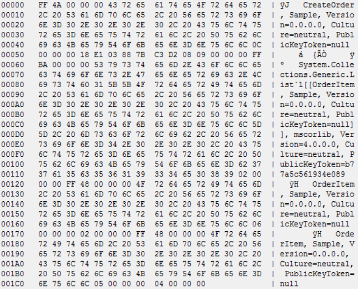

## NServiceBus.Wire

This samples uses the community run serializer [NServiceBus.Wire](https://github.com/hmemcpy/NServiceBus.Wire) to serialize messages with the [Wire](https://github.com/rogeralsing/Wire) binary format.

## Configuring to use Wire 

<!-- import config -->

## The message send

<!-- import message -->

## The Output

Since Wire is a binary format there is not much human readable in the message body.

