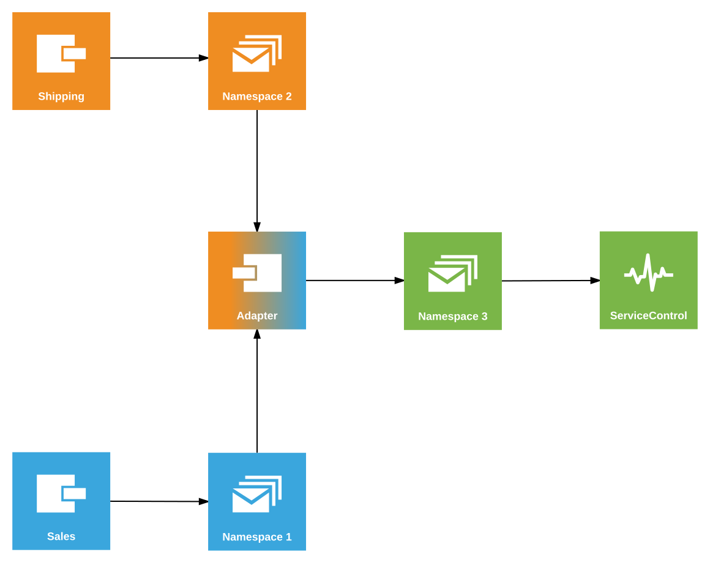

This sample shows how to configure ServiceControl to monitor endpoints and retry messages when using Azure Service Bus transport with advanced features [not supported by ServiceControl](/servicecontrol/transport-adapter/incompatible-features.md#azure-service-bus).

## Prerequisistes

include: asb-connectionstring

 1. An environment variable named `AzureServiceBus.ConnectionString` with the connection string for the Azure Service  Bus namespace to be used by the endpoints.
 1. An environment variable named `AzureServiceBus.ConnectionString.SC` with the connection string for the Azure Service Bus namespace to be used by the adapter.
 1. [Install ServiceControl](/servicecontrol/installation.md).
 1. Using [ServiceControl Management](/servicecontrol/license.md#servicecontrol-management-app) tool, set up ServiceControl to monitor endpoints using Azure Service Bus transport:
	 
   * Add a new ServiceControl instance: 
   * Use `Particular.ServiceControl.ASB` as the instance name (make sure there is no other instance of SC running with the same name).
   * Use connection string supplied with the `AzureServiceBus.ConnectionString.SC` environment variable.
   
NOTE: If other ServiceControl instances have been running on this machine, it's necessary to specify a non-default port number for API. [Adjust ServicePulse settings](/servicepulse/host-config.md#changing-the-servicecontrol-url) accordingly to point to this location.
 
 1. Ensure the `ServiceControl` process is running before running the sample.
 1. [Install ServicePulse](/servicepulse/installation.md)

include: adapter-running-project

## Code walk-through 

The following diagram shows the topology of the solution:

The code base consists of four projects.

### Shared

The Shared project contains the message contracts and the physical topology definition. The topology is defined in the `Connections` class via a method that takes the name of the queue table ([physical address](/transports/sql/addressing.md)) and returns the connection string to be used to access that queue.

<!--
__snippet: GetConnectionString

The `StartsWith` comparison ensures that the [satellite](/nservicebus/satellites/) queues are correctly addressed. The [poison queue](/servicecontrol/transport-adapter/#queue-configuration-poison-message-queue) is used by the adapter for unrecoverable failures. 

This topology is used in business endpoints (Sales, Shipping) as well as in the Adapter.
-->

### Sales and Shipping

The Sales and Shipping projects contain endpoints that simulate execution of business process. The process consists of two events: `OrderAccepted` published by Sales and subscribed by Shipping and `OrderShipped` published by Shipping and subscribed by Sales.

The Sales and Shipping endpoints use separate databases and their transports are configured in the [multi-instance](/transports/sql/deployment-options.md#modes-overview-multi-instance) mode using the topology definition from the `Connections` class.

The business endpoints include message processing failure simulation mode (toggled by pressing `f`) which can be used to generate failed messages for demonstrating message retry functionality.

The Shipping endpoint has the Heartbeats plugin installed to enable uptime monitoring via ServicePulse.

### Adapter

The Adapter project hosts the `ServiceControl.TransportAdapter`. The adapter has two sides: endpoint-facing and ServiceControl-facing. In this sample both use Azure Service Bus transport:

snippet: AdapterTransport

The following code configures the adapter to match advanced transport features enabled on the endpoints:  
- [Secure connection strings](/transports/azure-service-bus/securing-connection-strings.md) mode of SQL Server transport when communicating with the business endpoints.
- [Customized brokered message creation](/transports/azure-service-bus/brokered-message-creation.md) using `Stream`

snippet: EndpointSideConfig

While the following code configures the adapter to communicate with ServiceControl:

snippet: SCSideConfig

Because the ServiceControl has been installed under a non-default instance name (`Particular.ServiceControl.ASB`) the control queue name needs to be overridden in the adapter configuration:

snippet: ControlQueueOverride

include: adapter-how-it-works