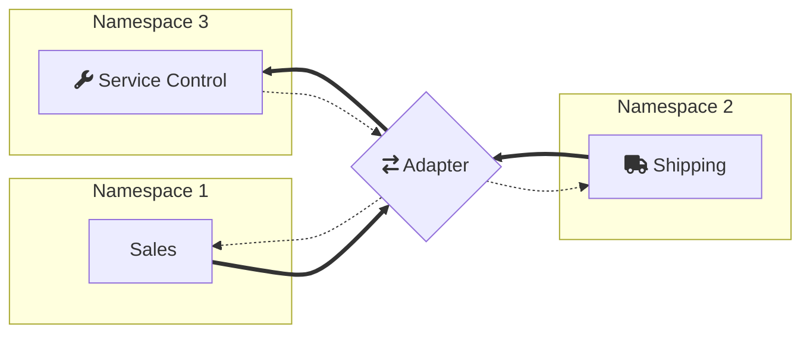

This sample shows how to configure ServiceControl to monitor endpoints and retry messages when using Azure Service Bus transport with advanced features [not supported by ServiceControl](/servicecontrol/transport-adapter/incompatible-features.md#azure-service-bus).

## Prerequisistes

include: asb-connectionstring

 1. An environment variable named `AzureServiceBus.ConnectionString.1` with the connection string for the Azure Service Bus namespace to be used by Sales endpoint.
 1. An environment variable named `AzureServiceBus.ConnectionString.2` with the connection string for the Azure Service Bus namespace to be used by Shipping endpoint.
 1. An environment variable named `AzureServiceBus.ConnectionString.SC` with the connection string for the Azure Service Bus namespace to be used by ServiceControl and the adapter.
 1. [Install ServiceControl](/servicecontrol/installation.md).
 1. Using [ServiceControl Management](/servicecontrol/license.md#servicecontrol-management-app) tool, set up ServiceControl to monitor endpoints using Azure Service Bus transport:
	 
   * Add a new ServiceControl instance: 
   * Use `Particular.ServiceControl.ASB` as the instance name (make sure there is no other instance of SC running with the same name).
   * Use connection string supplied with the `AzureServiceBus.ConnectionString.SC` environment variable.
   
NOTE: If other ServiceControl instances have been running on this machine, it's necessary to specify a non-default port number for API. [Adjust ServicePulse settings](/servicepulse/host-config.md#changing-the-servicecontrol-url) accordingly to point to this location.
 
 1. Ensure the `ServiceControl` process is running before running the sample.
 1. [Install ServicePulse](/servicepulse/installation.md)

include: adapter-running-project

## Code walk-through 

The following diagram shows the topology of the solution:

The code base consists of four projects.

### Shared

The Shared project contains the message contracts.

### Sales and Shipping

The Sales and Shipping projects contain endpoints that simulate execution of business process. The process consists of two messages: `ShipOrder` command sent by Sales and `OrderShipped` reply sent by Shipping.

The Sales and Shipping endpoints include message processing failure simulation mode (toggled by pressing `f`) which can be used to generate failed messages for demonstrating message retry functionality.

The Shipping endpoint has the Heartbeats plugin installed to enable uptime monitoring via ServicePulse.

Both endpoints are configured to use:

 * [Secure connection strings](/transports/azure-service-bus/securing-connection-strings.md).
 * [Customized brokered message creation](/transports/azure-service-bus/brokered-message-creation.md) using `Stream`.
 * Different namespaces with [cross-namespace routing](/transports/azure-service-bus/multiple-namespaces-support.md#cross-namespace-routing) enabled.

snippet: featuresunsuportedbysc

### Adapter

The Adapter project hosts the `ServiceControl.TransportAdapter`. The adapter has two sides: endpoint-facing and ServiceControl-facing. In this sample both use Azure Service Bus transport:

snippet: AdapterTransport

The following code configures the adapter to match advanced transport features enabled on the endpoints:

 * [Secure connection strings](/transports/azure-service-bus/securing-connection-strings.md).
 * [Customized brokered message creation](/transports/azure-service-bus/brokered-message-creation.md) using `Stream`.
 * [Multiple namespace](/transports/azure-service-bus/multiple-namespaces-support.md#round-robin-namespace-partitioning)

snippet: EndpointSideConfig

While the following code configures the adapter to communicate with ServiceControl:

snippet: SCSideConfig

Since ServiceControl has been installed under a non-default instance name (`Particular.ServiceControl.ASB`) the control queue name needs to be overridden in the adapter configuration:

snippet: ControlQueueOverride

Shipping and Sales use different namespaces, therefore the adapter has to be configured to properly route retried messages:

snippet: UseNamespaceHeader

The actual destination address consists of the queue name and the namespace alias which is included in the failed messages:

snippet: NamespaceAlias

Azure Service Bus transport version 6 used by ServiceControl overrides the `NServiceBus.ReplyToAddress` header when sending a message. The following code ensures that the original value is preserved by copying the header value to a custom header and then restoring the value when routing the retry message:

snippet: PreserveReplyToAddress

## How it works

### Heartbeats

The heartbeat messages arrive at the adapter's `Particular.ServiceControl` queue. They are then moved to `Particular.ServiceControl.ASB` queue in the ServiceControl namespace. In case of problems (e.g. destination namespace is down) the forward attempts are repeated configurable number of times after which messages are dropped to prevent the queue from growing indefinitely.

### Audits

The audit messages arrive at adapter's `audit` queue. They are then moved to the `audit` queue in ServiceControl namespace and are ingested by ServiceControl.

### Retries

If a message fails all recoverability attempts in a business endpoint, it is moved to the `error` queue located in the adapter namespace. The adapter enriches the message by adding `ServiceControl.RetryTo` header pointing to the adapter's input queue in ServiceControl namespace (`ServiceControl.ASB.Adapter.Retry`). Then the message is moved to the `error` queue in ServiceControl namespace and ingested into ServiceControl RavenDB store.

When retrying, ServiceControl looks for `ServiceControl.RetryTo` header and, if it finds one, it sends the message to the queue from that header instead of the ultimate destination.

The adapter picks up the message and forwards it to the destination using its endpoint-facing transport.