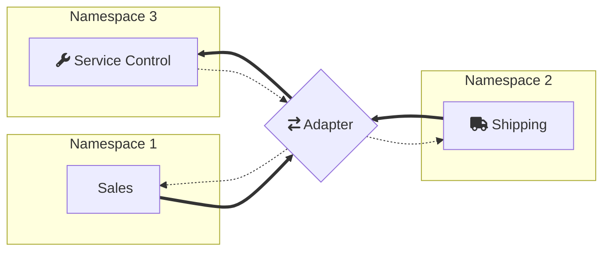

This sample shows how to configure ServiceControl to monitor endpoints and retry messages when using the advanced features of the Azure Service Bus transport [not natively supported by ServiceControl](/servicecontrol/transport-adapter/incompatible-features.md#azure-service-bus-transport-legacy).

The following diagram shows the topology of the solution:

Notice that `Sales` and `Shipping` are in two different namespaces. Cross-namespace routing is implemented using [NServiceBus.Router](https://github.com/SzymonPobiega/NServiceBus.Router) community project. The other important thing to note is that ServiceControl is in a different namespace than the other endpoints, which means that it can't natively communicate with them. This is why the sample shows how to create multi-directional router to bridge between all the components.

## Prerequisites

include: asb-connectionstring

 1. An environment variable named `AzureServiceBus.ConnectionString.1` with the connection string for the Azure Service Bus namespace to be used by the Sales endpoint.
 1. An environment variable named `AzureServiceBus.ConnectionString.2` with the connection string for the Azure Service Bus namespace to be used by the Shipping endpoint.
 1. An environment variable named `AzureServiceBus.ConnectionString.SC` with the connection string for the Azure Service Bus namespace to be used by ServiceControl and the adapter.
 1. [Install ServiceControl](/servicecontrol/installation.md).
 1. Using the [ServiceControl Management tool](/servicecontrol/license.md#servicecontrol-management-tool), set up ServiceControl to monitor endpoints using the Azure Service Bus transport:
	 
   * Add a new ServiceControl instance: 
   * Use `Particular.ServiceControl` as the instance name (ensure there is no other instance of SC running with the same name).
   * Use the connection string supplied with the `AzureServiceBus.ConnectionString.SC` environment variable.
   
include: configuring-sc-connections
 
 1. Ensure the `ServiceControl` process is running before running the sample.
 1. [Install ServicePulse](/servicepulse/installation.md)

include: adapter-running-project

## Code walk-through 

The solution consists of four projects.

### Shared

The Shared project contains the message contracts.

### Sales and Shipping

The Sales and Shipping projects contain endpoints that simulate the execution of a business process. The process consists of two messages: `ShipOrder` command sent by Sales and `OrderShipped` reply sent by Shipping.

The Sales and Shipping endpoints include a message processing failure simulation mode (toggled by pressing `f`) which can be used to generate failed messages for demonstrating message retry functionality.

The Shipping endpoint has the [Heartbeat plugin](/monitoring/heartbeats/) installed to enable uptime monitoring via ServicePulse.

### Router

The Router project hosts the `ServiceControl.TransportAdapter` and `NServiceBus.Router` instances. It uses a helper class `NamespaceRouter` to configure the bridging. The class accepts a list of structures describing namespaces of the system. For each namespace that hosts endpoints it executes three steps.

snippet: setup

First, it creates a `NServiceBus.Router` interface for this namespace

snippet: RouterInterface

Second, it configures a `ServiceControl.TransportAdapter` between that namespace and the ServiceControl namespace

snippet: AdapterInterface

Last but not least, it configures convention-based routing between the endpoints. The convention configures the router to forward messages to the namespace that matches the last part of the endpoint name e.g. a command destined to `MyPaymentGateway.Billing` will be forwarded to the `Billing` namespace.

snippet: ConventionBasedRouting

As a result, apart from the queues associated with the business endpoints, each namespace contains a set of queues used for the cross-namespace routing:

- `audit` - forwarded to ServiceControl's `audit` queue
- `error` - forwarded to ServiceControl's `error` queue
- `particular.servicecontrol` (or other that matches the name of the ServiceControl instance)
- `router` - endpoints send messages to this queue when they want these messages to be delivered to an endpoint in another namespace

The ServiceControl namespace, apart from regular set of queues, contains queues used for forwarding retried messages (one for each business namespace):

- `billing.adapter.retry`
- `shipping.adapter.retry`