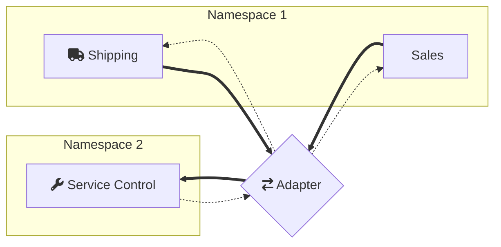

This sample shows how to configure ServiceControl to monitor endpoints and retry messages when using the advanced features of the Azure Storage Queues transport [not natively supported by ServiceControl](/servicecontrol/transport-adapter/incompatible-features.md#azure-storage-queues).

The following diagram shows the topology of the solution:

Notice that ServiceControl is in a different namespace from the other endpoints, which means that it can't natively communicate with `Sales` and `Shipping` endpoints. This sample shows how to create an adapter to bridge between everything.

The adapter also deals with advanced features of the Azure Storage Queues transport such as [multi-storage accounts](/transports/azure-storage-queues/multi-storageaccount-support.md) and [secure connection strings](/transports/azure-storage-queues/configuration.md#connection-strings-using-aliases-for-connection-strings-to-storage-accounts).

## Prerequisites

 1. An environment variable named `AzureStorageQueue.ConnectionString.1` with the connection string for the Azure Storage Queues account to be used by `Sales` and `Shipping` endpoints.
 1. An environment variable named `AzureStorageQueue.ConnectionString.SC` with the connection string for the Azure Storage Queues account to be used by ServiceControl and the adapter.
 1. [Install ServiceControl](/servicecontrol/installation.md).
 1. Using [ServiceControl Management](/servicecontrol/license.md#servicecontrol-management-app) tool, set up ServiceControl to monitor endpoints using Azure Storage Queues transport:
	 
   * Add a new ServiceControl instance: 
   * Use `Particular.ServiceControl.ASQ` as the instance name (ensure there is no other instance of SC running with the same name).
   * Use connection string supplied with the `AzureStorageQueue.ConnectionString.SC` environment variable.
   
NOTE: If other ServiceControl instances have been running on this machine, it's necessary to specify a non-default port number for API. [Adjust ServicePulse settings](/servicepulse/host-config.md#changing-the-servicecontrol-url) accordingly to point to this location.
 
 1. Ensure the `ServiceControl` process is running before running the sample.
 1. [Install ServicePulse](/servicepulse/installation.md)

include: adapter-running-project

## Code walk-through 

The code base consists of four projects.

### Shared

The Shared project contains the message contracts.

### Sales and Shipping

The Sales and Shipping projects contain endpoints that simulate the execution of a business process. The process consists of two messages: `ShipOrder` command sent by Sales and `OrderShipped` reply sent by Shipping.

The Sales and Shipping endpoints include a message processing failure simulation mode (toggled by pressing `f`) which can be used to generate failed messages for demonstrating message retry functionality.

The Shipping endpoint has the Heartbeats plugin installed to enable uptime monitoring via ServicePulse.

Both endpoints are configured to use:

 * [Secure connection strings](/transports/azure-storage-queues/configuration.md#connection-strings-using-aliases-for-connection-strings-to-storage-accounts).
 
snippet: featuresunsuportedbysc

### Adapter

The Adapter project hosts the `ServiceControl.TransportAdapter`. The adapter has two sides:

 * endpoint facing
 * ServiceControl facing

In this sample both use Azure Storage Queues transport:

snippet: AdapterTransport

Azure Storage Queues service doesn't support message headers. NServiceBus transport implements transport headers by using `MessageWrapper` to store headers and body as serialized storage message. For adapter to function it has to know how to de-serialize/serialize messages.

snippet: serializer-workaround

The following code configures the adapter to match advanced transport features enabled on the endpoints:

 * [Secure connection strings](/transports/azure-storage-queues/configuration.md#connection-strings-using-aliases-for-connection-strings-to-storage-accounts).
 * [Multi-storage accounts](/transports/azure-storage-queues/multi-storageaccount-support.md).

snippet: EndpointSideConfig

While the following code configures the adapter to communicate with ServiceControl:

snippet: SCSideConfig

Since ServiceControl has been installed under a non-default instance name (`Particular.ServiceControl.ASQ`) the control queue name needs to be overridden in the adapter configuration:

snippet: ControlQueueOverride

Shipping and Sales use different namespaces, therefore the adapter has to be configured to properly route retried messages:

snippet: UseStorageAccountHeader

The destination address consists of the queue name and the storage account alias which is included in the failed messages:

snippet: NamespaceAlias
